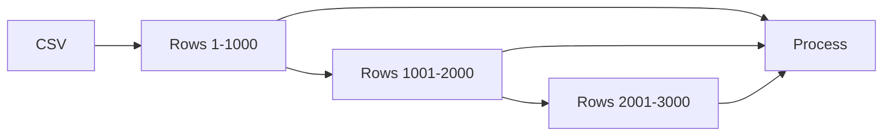
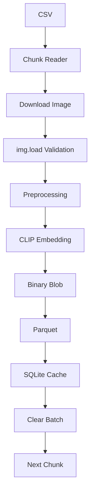

# Memory Optimization Notes

# Efficient Memory Management in the Embedding Pipeline

Large-scale embedding generation can easily process **millions of products** and **terabytes of images**. Without careful memory management, the pipeline may:

- Run Out of Memory (OOM)
- Continuously swap to disk
- Slow down dramatically
- Crash during inference

This document explains every major memory optimization used in the pipeline.

---

# Memory Optimization Overview


Instead of loading everything into RAM, data flows through the pipeline in small controlled batches.

---

# 1. CSV Chunking

## Why?

A product catalog may contain:

- 500,000 products
- 5 million products
- 50 million products

Loading the entire CSV at once may require several gigabytes of RAM.

Example:

| Products | Estimated RAM |
|-----------|---------------|
| 100K | ~300 MB |
| 1 Million | ~3 GB |
| 10 Million | 30+ GB |

Most machines cannot hold the full dataset comfortably.

---

## How?

Instead of:

```python
df = pd.read_csv("products.csv")
```

we use:

```python
pd.read_csv(
    "products.csv",
    chunksize=1000
)
```

Now Pandas returns:

```
Chunk 1
↓

Chunk 2
↓

Chunk 3
↓

...
```

Each chunk is processed independently.

---

## Where?

Used inside

```
src/pipeline/data_loader.py
```

while reading the raw catalog.

---

## When?

Every time the embedding pipeline begins reading the dataset.

Especially important for:

- Large CSV files
- Limited RAM systems
- Cloud VMs
- Docker containers

---

## Visualization



---

# 2. SQLite MEMORY Journal

## Why?

The embedding cache stores information like:

- already processed images
- downloaded URLs
- generated embeddings

SQLite normally writes every transaction to disk.

Disk writes become a bottleneck after thousands of inserts.

---

## How?

Enable SQLite Memory Journal:

```sql
PRAGMA journal_mode = MEMORY;
```

Instead of:

```
Write
↓

SSD

↓

Write Again

↓

SSD
```

SQLite temporarily keeps the journal in RAM.

Only the final database is written.

---

## Benefits

- Less SSD wear
- Faster inserts
- Reduced disk I/O
- Better throughput

---

## Where?

Embedding cache database

```
cache.db
```

inside

```
src/core/cache.py
```

---

## When?

During large batch insert operations.

Useful when caching:

- image hashes
- embedding hashes
- processed product IDs

---

## Visualization

```mermaid
flowchart LR

Insert

-->RAM Journal

-->Database
```

instead of

```text
Insert

↓

SSD Journal

↓

SSD Database
```

---

# 3. Binary Blobs in Parquet

## Why?

Each CLIP embedding contains

```
512 float values
```

If stored as a list:

```
[
0.12,
0.45,
...
512 numbers
]
```

PyArrow creates a nested list structure.

Nested lists consume more memory.

---

## Better Approach

Convert the vector into raw bytes.

```python
embedding.astype(np.float32).tobytes()
```

Now each embedding becomes

```
Binary Blob
```

instead of

```
Python List
```

---

## Benefits

- Smaller Parquet files
- Faster writes
- Lower RAM usage
- Less Arrow overhead

---

## Where?

During export

```
build_embeddings.py
```

before saving

```
embeddings.parquet
```

---

## When?

Immediately after generating each embedding.

---

## Visualization


instead of

```mermaid
flowchart LR

Vector

-->Python List

-->Arrow Nested Lists

-->Parquet
```

---

# 4. Batch Clearing

## Why?

Every processed batch creates objects like:

- PIL Images
- Torch tensors
- NumPy arrays
- Metadata dictionaries

If batches accumulate,

RAM usage continuously grows.

Example:

```
Batch 1

Batch 2

Batch 3

Batch 4

...

Memory keeps increasing.
```

---

## How?

After every batch:

```python
batch.clear()

del tensors

gc.collect()
```

Old objects become eligible for garbage collection.

---

## Benefits

- Stable RAM usage
- Prevents memory leaks
- Long-running jobs stay reliable

---

## Where?

After every inference batch

inside

```
build_embeddings.py
```

---

## When?

Immediately after:

- embedding generation
- Parquet writing
- cache update

---

## Visualization

```mermaid
flowchart LR

Batch

-->Inference

-->Write

-->Clear Memory

-->Next Batch
```

---

# 5. img.load()

## Why?

Downloading an image only retrieves compressed bytes.

A corrupted image may appear valid until decoding.

Example:

```
JPEG

↓

Download Successful

↓

Decode Failed
```

Without validation, the pipeline crashes later.

---

## How?

```python
img.load()
```

This forces Pillow to:

- decode the image
- verify integrity
- allocate image pixels in memory

If decoding fails,

the image is skipped immediately.

After processing,

the decoded image is released.

---

## Benefits

- Early corruption detection
- Prevents downstream inference failures
- Cleaner dataset

---

## Where?

Inside

```
src/core/image_processor.py
```

after opening an image.

---

## When?

Before:

- resize
- normalization
- tensor conversion
- CLIP inference

---

## Visualization

```mermaid
flowchart LR

Download

-->Open

-->img.load()

-->Valid

-->Resize

-->CLIP
```

Invalid images exit the pipeline before expensive GPU inference.

---

# Complete Memory Flow



---

# Summary

| Optimization | Why | Where | Benefit |
|--------------|------|---------|----------|
| CSV Chunking | Prevent Out-of-Memory | Data Loader | Constant RAM usage |
| SQLite MEMORY Journal | Reduce disk writes | Embedding Cache | Faster caching |
| Binary Blobs | Compact embedding storage | Parquet Export | Lower RAM and file size |
| Batch Clearing | Free temporary objects | Batch Pipeline | Stable memory usage |
| `img.load()` | Validate image integrity | Image Processor | Prevent inference failures |

---

# Key Takeaways

- Process **small chunks** instead of entire datasets.
- Keep **temporary database journals in RAM** for high-speed caching.
- Store embeddings as **binary blobs** rather than nested arrays to reduce storage overhead.
- Explicitly **release batch objects** after each inference cycle to maintain stable memory usage.
- Validate images early with `img.load()` so corrupted files never reach the GPU inference stage.

Together, these optimizations allow the embedding pipeline to scale efficiently from thousands to millions of products while keeping memory usage predictable, minimizing disk I/O, and improving overall throughput.
