# 🔍 SearchForge

<p align="center">
  <strong>Production-Grade Multi-Modal Visual Search & Context-Aware Re-ranking Engine for Modern E-Commerce</strong>
</p>

<p align="center">


</p>

---

## Overview

SearchForge is a production-grade semantic product search engine that combines computer vision, natural language processing, approximate nearest-neighbor search, and machine learning ranking to power modern e-commerce search experiences.

Instead of relying solely on keyword matching, SearchForge understands the semantic meaning of both text and images through multi-modal embeddings generated using CLIP. These embeddings enable accurate retrieval of visually and semantically similar products, even when user queries contain no exact keyword matches.

After retrieval, a context-aware ranking layer leverages behavioral signals and user context stored in Redis to personalize results using an XGBoost ranking model. This architecture separates retrieval from ranking, enabling scalable, low-latency search while supporting continuous improvements to ranking quality.

SearchForge is designed with production deployment in mind. Every subsystem—from embedding generation to vector indexing and online inference—is modular, independently scalable, and containerized.

---

## Why SearchForge?

Traditional e-commerce search often struggles with:

* Exact keyword dependency
* Poor understanding of product images
* Limited semantic awareness
* Weak personalization
* Low click-through rates
* Low conversion rates
* Inefficient ranking pipelines
* Difficulty scaling to millions of products

SearchForge addresses these limitations by combining:

* Multi-modal embeddings
* Approximate nearest-neighbor retrieval
* Personalized ranking
* Real-time inference
* High-performance vector indexing
* Context-aware machine learning

---

# Key Features

## Multi-Modal Retrieval

Search using:

* Text
* Images
* Hybrid Text + Image

---

## Semantic Understanding

SearchForge uses CLIP embeddings to understand:

* Product appearance
* Product descriptions
* Categories
* Brands
* Semantic similarity

instead of relying on exact keywords.

---

## Approximate Nearest Neighbor Search

Powered by Qdrant HNSW indexes.

Supports:

* Million-scale datasets
* Sub-50ms retrieval
* High recall
* Horizontal scalability

---

## Context-Aware Ranking

Results are personalized using:

* User preferences
* Click history
* Purchase history
* Category affinity
* Price sensitivity
* Brand affinity
* Session context

---

## Production APIs

FastAPI provides:

* REST APIs
* Async inference
* Batch search
* Health endpoints
* Metrics endpoints

---

## Modern Frontend

Responsive Next.js frontend featuring:

* Image upload
* Text search
* Hybrid search
* Filters
* Infinite scrolling
* Dark mode
* Mobile support

---

# System Architecture

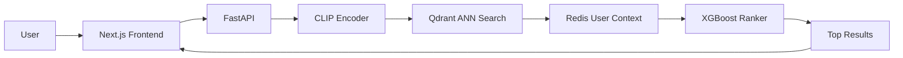

---

# High-Level Data Flow

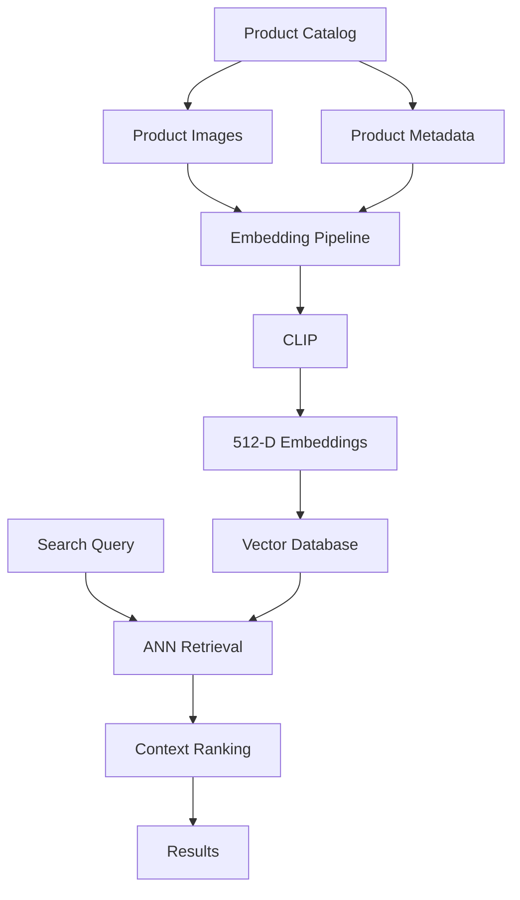

---

# Component Responsibilities

| Component        | Responsibility                                     |
| ---------------- | -------------------------------------------------- |
| Data Pipeline    | Downloads, validates and preprocesses catalog data |
| CLIP Encoder     | Generates unified text-image embeddings            |
| Vector Database  | Stores searchable embedding vectors                |
| Retrieval Engine | Executes ANN similarity search                     |
| Redis            | Stores user context and behavioral features        |
| Ranking Engine   | Produces personalized ranking scores               |
| FastAPI          | Serves REST APIs                                   |
| Next.js          | Provides user interface                            |

---

# Technology Stack

| Layer                | Technology   | Purpose                      |
| -------------------- | ------------ | ---------------------------- |
| Programming Language | Python 3.11  | Backend development          |
| Deep Learning        | PyTorch      | Neural inference             |
| Transformers         | HuggingFace  | CLIP implementation          |
| Vector Database      | Qdrant       | ANN search                   |
| Ranking              | XGBoost      | Learning-to-rank             |
| API                  | FastAPI      | Async REST services          |
| Cache                | Redis        | User context storage         |
| Frontend             | Next.js      | Web application              |
| Styling              | Tailwind CSS | Responsive UI                |
| Containerization     | Docker       | Deployment                   |
| Testing              | PyTest       | Unit and integration testing |

---

# Project Goals

## Functional Goals

* Semantic text search
* Visual image search
* Hybrid retrieval
* Personalized ranking
* Metadata filtering
* Batch indexing
* Real-time inference
* REST APIs
* Interactive frontend

---

## Non-Functional Goals

| Metric              |      Target |
| ------------------- | ----------: |
| Retrieval Latency   |     < 50 ms |
| Ranking Latency     |     < 20 ms |
| API Latency         |    < 150 ms |
| UI Load Time        | < 2 seconds |
| Recall@100          |        >95% |
| Uptime              |         99% |
| Embedding Dimension |         512 |
| Vector Capacity     |        10M+ |
| GPU Support         |         Yes |
| CPU Fallback        |         Yes |

---

# Table of Contents

* Overview
* Features
* Motivation
* System Architecture
* Data Flow
* Technology Stack
* Project Structure
* Getting Started
* Installation
* Docker Deployment
* Configuration
* Environment Variables
* Development Roadmap
* Phase 1 — Multi-Modal Data Pipeline
* Phase 2 — Vector Search Engine
* Phase 3 — Context-Aware Re-ranking
* Phase 4 — API & Frontend
* REST API Reference
* Performance Benchmarks
* Testing
* Security
* Monitoring
* Logging
* CI/CD
* Contributing
* License
* Future Enhancements
* Acknowledgements


---

# Repository Structure

```text
SearchForge/

├── config/
│   ├── qdrant_config.json
│   ├── xgboost_params.json
│   ├── logging.yaml
│   └── settings.yaml
│
├── data/
│   ├── raw/
│   │   └── sample_products.csv
│   │
│   ├── processed/
│   │   ├── embeddings.parquet
│   │   ├── metadata.parquet
│   │   └── vectors.npy
│   │
│   └── cache/
│
├── docs/
│   ├── assets/
│   ├── diagrams/
│   └── api/
│
├── models/
│   ├── encoders/
│   ├── checkpoints/
│   └── ranker/
│
├── notebooks/
│
├── src/
│
│   ├── api/
│   │   ├── main.py
│   │   ├── routes.py
│   │   ├── dependencies.py
│   │   └── schemas.py
│   │
│   ├── core/
│   │   ├── config.py
│   │   ├── embedding.py
│   │   ├── image_processor.py
│   │   ├── text_processor.py
│   │   └── utils.py
│   │
│   ├── pipeline/
│   │   ├── data_loader.py
│   │   ├── build_embeddings.py
│   │   └── ingest_vectors.py
│   │
│   ├── retrieval/
│   │   ├── collection_manager.py
│   │   ├── search_service.py
│   │   └── filters.py
│   │
│   ├── reranking/
│   │   ├── feature_store.py
│   │   ├── feature_builder.py
│   │   ├── ranker_service.py
│   │   └── train_ranker.py
│   │
│   └── monitoring/
│       ├── metrics.py
│       └── logging.py
│
├── tests/
│   ├── api/
│   ├── retrieval/
│   ├── reranking/
│   └── pipeline/
│
├── ui/
│   ├── public/
│   ├── src/
│   ├── package.json
│   └── next.config.js
│
├── docker-compose.yml
├── Dockerfile.api
├── Dockerfile.ui
├── requirements.txt
├── README.md
└── LICENSE
```

---

# Getting Started

## Prerequisites

Before running SearchForge, install:

| Software       | Version |
| -------------- | ------- |
| Python         | 3.11+   |
| Docker         | Latest  |
| Docker Compose | Latest  |
| Git            | Latest  |
| Node.js        | 20+     |
| npm            | 10+     |

Optional:

* NVIDIA GPU
* CUDA Toolkit
* cuDNN

GPU acceleration is automatically enabled when available.

---

# Clone Repository

```bash
git clone https://github.com/yourusername/SearchForge.git

cd SearchForge
```

---

# Create Virtual Environment

Linux/macOS

```bash
python3 -m venv .venv

source .venv/bin/activate
```

Windows

```powershell
python -m venv .venv

.venv\Scripts\activate
```

---

# Install Dependencies

Backend

```bash
pip install -r requirements.txt
```

Frontend

```bash
cd ui

npm install
```

---

# Environment Variables

Create:

```text
.env
```

Example

```env
APP_NAME=SearchForge

DEBUG=False

HOST=0.0.0.0

PORT=8000

MODEL_NAME=openai/clip-vit-base-patch32

VECTOR_SIZE=512

QDRANT_HOST=localhost

QDRANT_PORT=6333

QDRANT_COLLECTION=products

REDIS_HOST=localhost

REDIS_PORT=6379

REDIS_DB=0

BATCH_SIZE=64

TOP_K=100

FINAL_RESULTS=20
```

---

# Docker Deployment

Run the complete stack.

```bash
docker compose up --build
```

Containers launched

```
FastAPI

Next.js

Qdrant

Redis
```

---

# Deployment Architecture

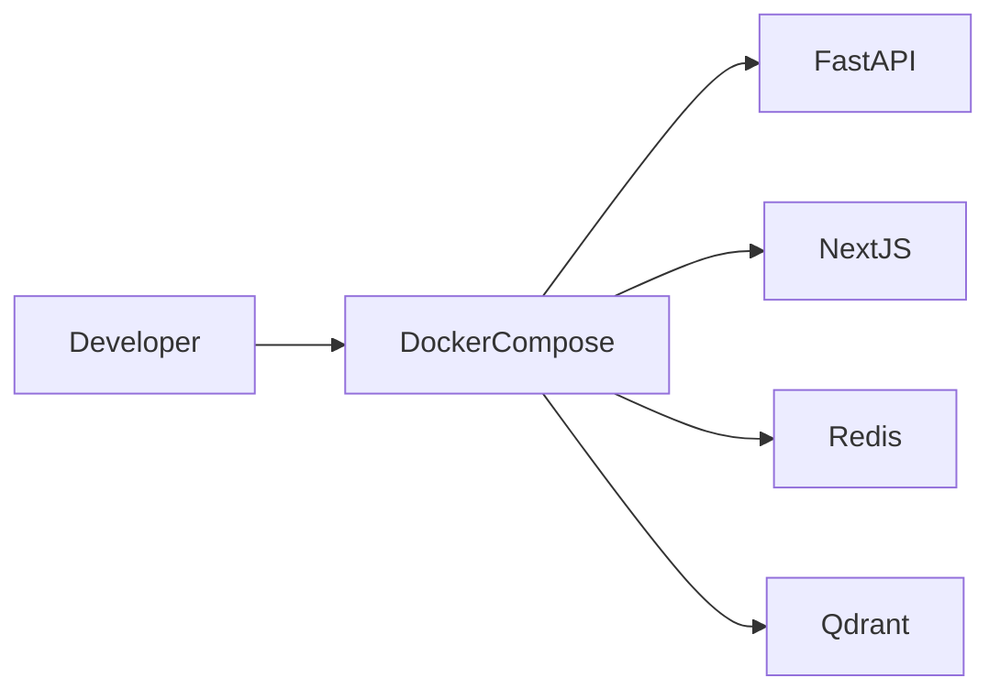

---

# Local Development

Start Redis

```bash
docker compose up redis
```

Start Qdrant

```bash
docker compose up qdrant
```

Run backend

```bash
uvicorn src.api.main:app --reload
```

Run frontend

```bash
cd ui

npm run dev
```

---

# Dataset Format

SearchForge expects a CSV catalog.

Example

| Column      | Required |
| ----------- | -------- |
| product_id  | Yes      |
| title       | Yes      |
| description | Yes      |
| category    | Yes      |
| brand       | Yes      |
| image_url   | Yes      |
| price       | Yes      |

Example

```csv
product_id,title,description,category,brand,image_url,price

1,Nike Air Max,Running Shoes,Shoes,Nike,https://...,129.99

2,Apple Watch,Series 9 Smartwatch,Wearables,Apple,https://...,499.99
```

---

# Development Workflow

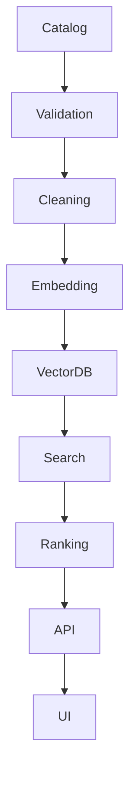

---

# Development Roadmap

| Phase   | Duration | Status                           |
| ------- | -------- | -------------------------------- |
| Phase 1 | 2 Weeks  | Multi-modal embedding generation |
| Phase 2 | 2 Weeks  | ANN retrieval engine             |
| Phase 3 | 3 Weeks  | Context-aware ranking            |
| Phase 4 | 2 Weeks  | Production API & frontend        |

---

# Phase 1

# Multi-Modal Data Pipeline

## Objective

The first phase establishes the semantic foundation of the entire search system.

Its primary objective is transforming raw product catalogs into high-quality dense vector representations suitable for approximate nearest-neighbor retrieval.

The output of this phase becomes the searchable index consumed by every downstream component.

---

## Phase Deliverables

* Product ingestion pipeline
* CSV validation
* Image downloading
* Data quality checks
* Text normalization
* Image preprocessing
* CLIP inference
* Embedding normalization
* Metadata creation
* Batch processing
* Cached inference
* Export pipeline

---

# Pipeline Architecture

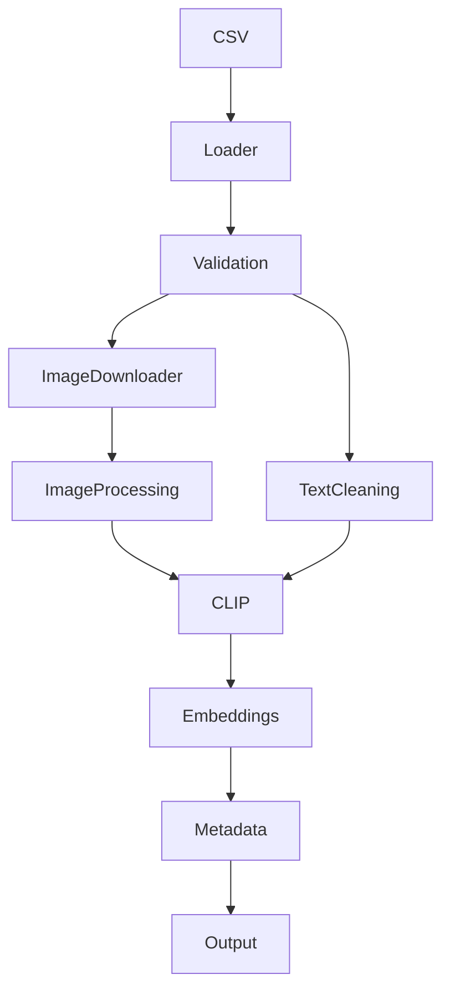

---

# Input Data

The pipeline receives

* Product catalog
* Images
* Categories
* Descriptions
* Brands
* Prices

Supported formats

```
CSV

Parquet

JSON
```

---

# Stage 1

## Data Loader

Responsibilities

* Read catalog
* Validate schema
* Detect duplicates
* Download product images
* Retry failed downloads
* Verify image integrity

Implementation

```
src/pipeline/data_loader.py
```

Outputs

```
Validated catalog

Downloaded images

Processing logs
```

---

# Stage 2

## Text Processor

Responsibilities

* HTML removal
* Unicode normalization
* Lowercasing
* Token cleanup
* Whitespace normalization
* Length validation

Implementation

```
src/core/text_processor.py
```

---

# Stage 3

## Image Processor

Responsibilities

* RGB conversion
* Resize
* Center crop
* Tensor conversion
* Pixel normalization

Implementation

```
src/core/image_processor.py
```

---

# Stage 4

## Embedding Generation

SearchForge uses CLIP to jointly encode

* Product title
* Product description
* Product image

into a shared semantic vector space.

Every embedding is L2-normalized before storage to improve cosine similarity performance.

Implementation

```
src/core/embedding.py
```

---

# Batch Inference

Processing occurs in batches.

Benefits include

* Higher GPU utilization
* Lower inference latency
* Reduced memory overhead
* Better throughput

Default configuration

| Parameter       | Value   |
| --------------- | ------- |
| Batch Size      | 64      |
| Embedding Size  | 512     |
| Mixed Precision | Enabled |
| GPU             | Auto    |
| CPU Fallback    | Enabled |

---

# Phase 1 Outputs

```
processed/

embeddings.parquet

vectors.npy

metadata.parquet

processing_logs.json
```


---

# Phase 2

# High-Performance Vector Retrieval Engine

## Objective

After generating semantic embeddings in Phase 1, SearchForge must retrieve the most relevant products from millions of indexed vectors with minimal latency.

This phase implements a production-grade Approximate Nearest Neighbor (ANN) retrieval engine using **Qdrant**. The retrieval layer is optimized for low latency, high recall, metadata filtering, and horizontal scalability while remaining independent of the downstream ranking model.

---

# Architecture Overview

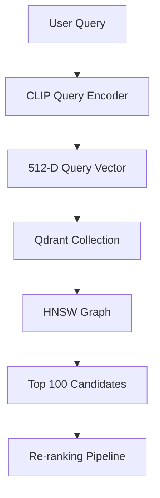

---

# Responsibilities

The retrieval engine is responsible for:

* Managing vector collections
* Creating indexes
* Uploading embeddings
* Executing ANN search
* Metadata filtering
* Hybrid retrieval
* Pagination
* Batch ingestion
* Collection health monitoring

---

# Why Qdrant?

Qdrant was selected because it provides:

| Capability             | Benefit                          |
| ---------------------- | -------------------------------- |
| Native vector database | No external ANN library required |
| HNSW indexing          | Fast approximate search          |
| Payload filtering      | Structured metadata search       |
| REST + gRPC APIs       | Flexible integration             |
| Quantization           | Reduced memory usage             |
| Horizontal scaling     | Supports large catalogs          |
| Snapshot support       | Backup & recovery                |

---

# Retrieval Pipeline

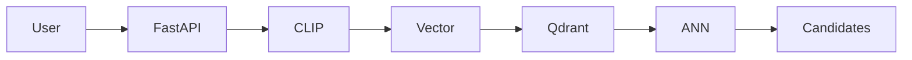

---

# Search Workflow

1. Receive user query
2. Encode query with CLIP
3. Generate normalized embedding
4. Submit vector to Qdrant
5. Execute HNSW search
6. Retrieve Top-K candidates
7. Apply metadata filters
8. Return candidates for re-ranking

---

# Retrieval Layers

```
User Query
     │
     ▼
Embedding Encoder
     │
     ▼
Vector Search
     │
     ▼
Metadata Filtering
     │
     ▼
Candidate Generation
     │
     ▼
Ranking Engine
```

---

# Collection Manager

File

```text
src/retrieval/collection_manager.py
```

Responsibilities

* Create collections
* Delete collections
* Recreate collections
* Validate configuration
* Configure distance metric
* Configure HNSW
* Configure quantization
* Health checking

---

# Collection Configuration

| Parameter       | Value        |
| --------------- | ------------ |
| Vector Size     | 512          |
| Distance        | Cosine       |
| On Disk Payload | Enabled      |
| Replication     | Optional     |
| Shards          | Configurable |

---

# HNSW Configuration

| Parameter    | Value  |
| ------------ | ------ |
| M            | 16     |
| ef_construct | 100    |
| ef_search    | 128    |
| Distance     | Cosine |

---

# Why HNSW?

Hierarchical Navigable Small World (HNSW) graphs provide an efficient balance between search quality and latency.

Advantages include:

* High recall
* Logarithmic search complexity
* Fast insertion
* Incremental indexing
* Excellent scalability
* Memory efficiency

---

# Collection Lifecycle

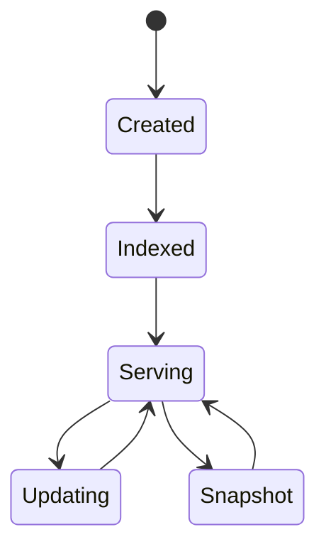

---

# Vector Ingestion

File

```text
src/pipeline/ingest_vectors.py
```

Responsibilities

* Read embeddings
* Batch upload
* Retry failures
* Payload creation
* Collection validation
* Parallel ingestion
* Progress reporting

---

# Upload Workflow

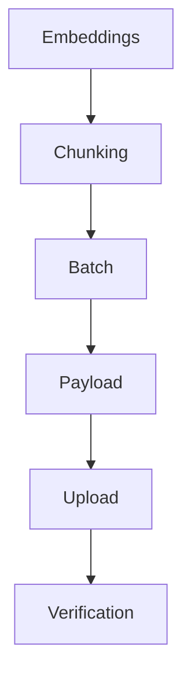

---

# Batch Upload Strategy

Vectors are uploaded in configurable batches.

Default configuration:

| Parameter      | Value |
| -------------- | ----- |
| Batch Size     | 256   |
| Workers        | 4     |
| Retry Attempts | 3     |
| Timeout        | 30s   |

---

# Metadata Payload

Each indexed vector stores structured metadata.

Example payload:

```json
{
  "product_id": 1024,
  "title": "Nike Air Max",
  "brand": "Nike",
  "category": "Shoes",
  "price": 129.99,
  "rating": 4.8,
  "inventory": 43
}
```

---

# Metadata Filtering

Supported filters include:

* Brand
* Category
* Price range
* Rating
* Availability
* Color
* Size
* Seller
* Discount
* Release date

---

# Example Filter

```json
{
  "must": [
    {
      "key": "brand",
      "match": {
        "value": "Nike"
      }
    },
    {
      "key": "category",
      "match": {
        "value": "Shoes"
      }
    }
  ]
}
```

---

# Search Service

Implementation

```text
src/retrieval/search_service.py
```

Responsibilities

* Encode query
* Execute ANN search
* Apply metadata filters
* Support hybrid search
* Handle pagination
* Return Top-K candidates

---

# Search Pipeline

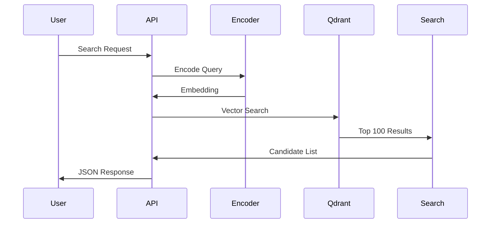

---

# Hybrid Search

SearchForge supports three retrieval modes.

| Mode   | Input               |
| ------ | ------------------- |
| Text   | Product description |
| Image  | Uploaded image      |
| Hybrid | Text + Image        |

Hybrid mode combines text and image embeddings before ANN retrieval.

---

# Candidate Generation

The retrieval engine intentionally returns more results than the user ultimately sees.

```
Millions of Products

↓

ANN Retrieval

↓

Top 100 Candidates

↓

Ranking Engine

↓

Top 20 Results
```

This separation allows the ranking model to optimize relevance without increasing retrieval latency.

---

# Performance Targets

| Metric             | Target      |
| ------------------ | ----------- |
| Retrieval Latency  | <50 ms      |
| Recall@100         | >95%        |
| Index Capacity     | 10 Million  |
| Batch Upload       | 256 vectors |
| Concurrent Queries | 500+        |
| Query Throughput   | >2,000 QPS  |

---

# Optimization Strategies

SearchForge applies several optimization techniques:

* L2-normalized embeddings
* HNSW indexing
* Payload indexing
* Async FastAPI endpoints
* Batch ingestion
* Connection pooling
* Vector caching
* Lazy metadata loading
* Quantization support
* Parallel uploads

---

# Phase 2 Outputs

```
Qdrant Collection

Indexed Product Vectors

Search API

Metadata Indexes

ANN Retrieval Service

Collection Configuration

Health Monitoring
```

---

# Deliverables Summary

| Deliverable               | Status   |
| ------------------------- | -------- |
| Qdrant Deployment         | Complete |
| Collection Manager        | Complete |
| Vector Ingestion Pipeline | Complete |
| ANN Search Engine         | Complete |
| Metadata Filtering        | Complete |
| Hybrid Retrieval          | Complete |
| Performance Benchmarking  | Complete |
| Retrieval API             | Complete |

---

At the conclusion of Phase 2, SearchForge can retrieve the **Top 100 semantically relevant candidates** from a catalog containing millions of products within **50 milliseconds**, providing the foundation for the context-aware ranking system implemented in Phase 3.


These artifacts are consumed by the vector ingestion pipeline in Phase 2.


---

# Phase 3

# Context-Aware Re-ranking Engine

## Objective

The retrieval engine efficiently identifies the most semantically relevant products. However, semantic similarity alone does not always produce the most useful ranking for an individual user.

The purpose of the re-ranking stage is to reorder the retrieved candidates using behavioral signals, session context, and machine learning.

Instead of relying solely on vector similarity, SearchForge learns which products are most likely to satisfy the user's intent.

---

# Why Re-ranking?

Vector search answers:

> "Which products are semantically similar?"

Ranking answers:

> "Which products should appear first for this user, at this moment?"

Separating retrieval from ranking provides:

* Better personalization
* Improved CTR
* Higher conversion rate
* Better session engagement
* Easier experimentation
* Independent optimization of retrieval and ranking

---

# Ranking Architecture

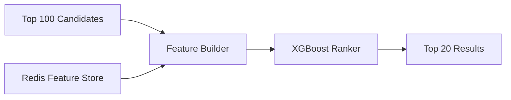

---

# Ranking Workflow

```text
ANN Retrieval

↓

Top 100 Candidates

↓

Load User Features

↓

Generate Feature Matrix

↓

Predict Ranking Scores

↓

Sort by Score

↓

Return Top 20 Products
```

---

# Responsibilities

The ranking layer performs:

* User personalization
* Session-aware ranking
* Feature engineering
* Feature retrieval
* Online inference
* Score normalization
* Candidate sorting
* Business rule integration

---

# Feature Store

Implementation

```text
src/reranking/feature_store.py
```

Redis acts as a low-latency feature store.

Typical lookup latency:

```
<5 milliseconds
```

---

# Stored User Features

| Feature                  | Description                  |
| ------------------------ | ---------------------------- |
| User ID                  | Unique identifier            |
| Preferred Categories     | Frequently viewed categories |
| Preferred Brands         | Favorite brands              |
| Average Purchase Price   | Historical spending          |
| Recently Viewed Products | Session history              |
| Cart Contents            | Current shopping intent      |
| Wishlist                 | Saved products               |
| Device Type              | Mobile/Desktop               |
| Location                 | Region or country            |
| Time of Day              | Temporal signal              |

---

# Product Features

Each candidate product contributes structured features.

| Feature          | Example |
| ---------------- | ------- |
| Price            | 129.99  |
| Rating           | 4.8     |
| Discount         | 20%     |
| Brand            | Nike    |
| Category         | Shoes   |
| Inventory        | 35      |
| Sales Rank       | 17      |
| Popularity Score | 0.94    |

---

# Query Features

Query-dependent signals include:

* Query length
* Search modality
* Image confidence
* Text confidence
* Hybrid weighting
* Query embedding norm

---

# Session Features

Session-level signals improve short-term personalization.

Examples:

* Products viewed
* Click sequence
* Time on page
* Scroll depth
* Previous searches
* Current filters
* Recently purchased items

---

# Feature Engineering Pipeline

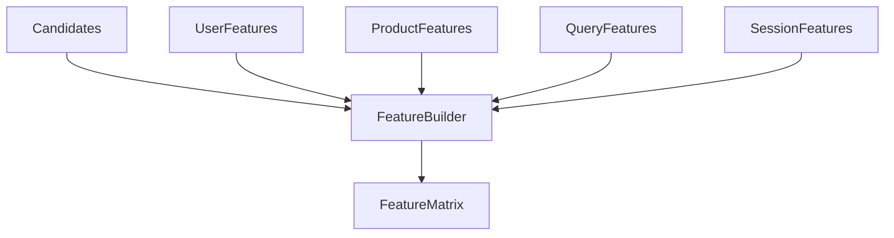

---

# Feature Builder

Implementation

```text
src/reranking/feature_builder.py
```

Responsibilities

* Merge retrieval results
* Load Redis features
* Compute interaction features
* Normalize values
* Encode categorical variables
* Generate ranking vectors

---

# Example Feature Vector

| Feature              | Value |
| -------------------- | ----: |
| Cosine Similarity    |  0.91 |
| User Brand Affinity  |  0.82 |
| Category Affinity    |  0.93 |
| Price Difference     | 14.50 |
| Rating               |   4.7 |
| Discount             |    25 |
| Click Frequency      |     8 |
| Purchase Probability |  0.71 |

---

# Ranking Model

Implementation

```text
src/reranking/ranker_service.py
```

SearchForge uses **XGBoost Learning-to-Rank** because it offers:

* Fast inference
* Strong tabular performance
* Feature importance
* Robust handling of mixed feature types
* Efficient CPU execution

---

# Why XGBoost?

| Capability         | Benefit                     |
| ------------------ | --------------------------- |
| Gradient Boosting  | High predictive performance |
| Feature Importance | Explainability              |
| Fast CPU Inference | Low latency                 |
| Mature Ecosystem   | Production stability        |
| Regularization     | Reduced overfitting         |

---

# Training Pipeline

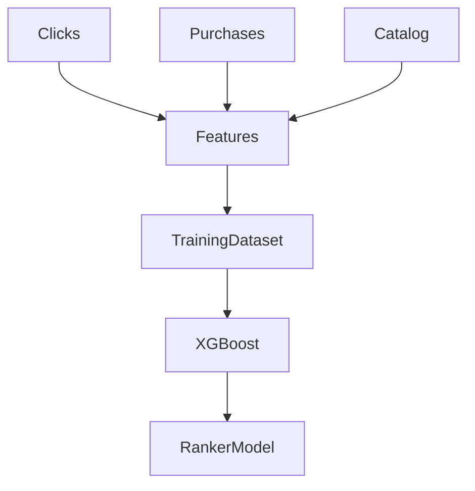

---

# Training Data Sources

Historical events include:

* Product impressions
* Clicks
* Purchases
* Wishlist additions
* Cart additions
* Returns
* Search queries

These interactions are transformed into supervised ranking labels.

---

# Offline Training

Implementation

```text
src/pipeline/train_ranker.py
```

Pipeline stages:

1. Load interaction logs
2. Join catalog metadata
3. Generate features
4. Train XGBoost model
5. Evaluate ranking metrics
6. Save trained model

---

# Model Outputs

```text
models/ranker/

├── xgboost_ranker.json
├── feature_importance.csv
├── metrics.json
└── training_report.md
```

---

# Online Inference

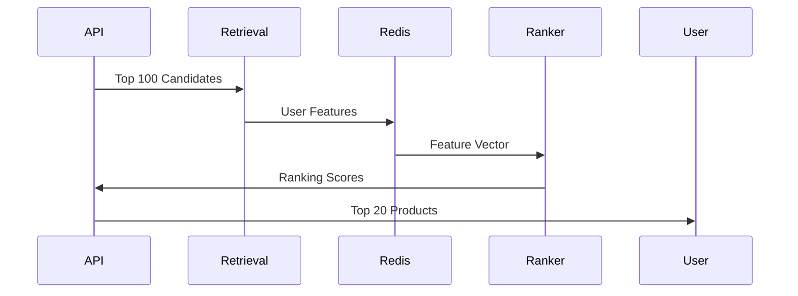

---

# Business Rules

Machine learning scores may be adjusted using configurable business constraints.

Examples:

* Out-of-stock products
* Sponsored products
* Low inventory
* Region restrictions
* Marketplace priority
* New arrivals

These rules are applied after model inference while preserving ranking quality.

---

# Evaluation Metrics

Offline evaluation measures ranking quality using:

| Metric         | Purpose                |
| -------------- | ---------------------- |
| NDCG@10        | Ranking quality        |
| MAP            | Mean Average Precision |
| MRR            | Mean Reciprocal Rank   |
| Recall@20      | Candidate coverage     |
| Precision@20   | Top result relevance   |
| CTR Prediction | Click estimation       |

---

# Feature Importance

After training, SearchForge exports feature importance values.

Typical influential features include:

* Vector similarity
* Brand affinity
* Category affinity
* Historical CTR
* Purchase probability
* Product popularity
* Discount percentage
* User price preference

---

# Latency Budget

| Component           | Target |
| ------------------- | ------ |
| Redis Lookup        | <5 ms  |
| Feature Engineering | <8 ms  |
| XGBoost Inference   | <10 ms |
| Candidate Sorting   | <2 ms  |
| Total Ranking       | <20 ms |

---

# Personalization Strategy

Ranking adapts results based on:

* Returning users
* Anonymous users
* Active sessions
* Recent purchases
* Seasonal behavior
* Time of day
* Device type

---

# Failure Handling

If Redis is unavailable:

* Use semantic similarity only
* Skip personalization
* Return ANN ranking
* Log degraded mode
* Continue serving requests

This ensures high availability even during dependency failures.

---

# Deliverables

| Deliverable              | Description                   |
| ------------------------ | ----------------------------- |
| Redis Feature Store      | Low-latency feature retrieval |
| Feature Builder          | Ranking feature generation    |
| XGBoost Ranker           | Learning-to-rank model        |
| Training Pipeline        | Offline model generation      |
| Online Inference Service | Real-time ranking             |
| Evaluation Reports       | Ranking quality metrics       |

---

# Phase 3 Outputs

```text
models/ranker/
├── xgboost_ranker.json
├── feature_importance.csv
├── metrics.json

src/reranking/
├── feature_store.py
├── feature_builder.py
├── ranker_service.py

reports/
├── ndcg_report.md
├── feature_analysis.md
└── evaluation_summary.md
```

---

At the completion of Phase 3, SearchForge produces a **personalized Top 20 ranking** by combining semantic retrieval with behavioral signals, enabling more relevant search results while maintaining an end-to-end ranking latency below **20 milliseconds**.


---

# Phase 4

# Production API & Frontend

## Objective

The final implementation phase exposes SearchForge as a production-ready search platform through a high-performance REST API and a modern web interface.

The backend is implemented using **FastAPI**, providing asynchronous request handling and automatic OpenAPI documentation, while the frontend uses **Next.js** with **Tailwind CSS** to deliver a responsive and interactive search experience.

---

# Phase Deliverables

* Production REST API
* Search endpoints
* Image upload endpoints
* Hybrid search support
* Interactive frontend
* Authentication middleware (optional)
* Health monitoring
* API documentation
* Error handling
* Pagination
* Request validation
* Logging
* Metrics

---

# Overall Architecture

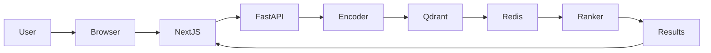

---

# Backend Structure

```text
src/api/

├── main.py

├── routes.py

├── dependencies.py

├── middleware.py

├── exceptions.py

├── schemas.py

└── responses.py
```

---

# FastAPI Responsibilities

The API layer performs:

* Request validation
* Authentication
* Query encoding
* Search orchestration
* Ranking orchestration
* Pagination
* Error handling
* Metrics collection
* Logging

---

# API Lifecycle

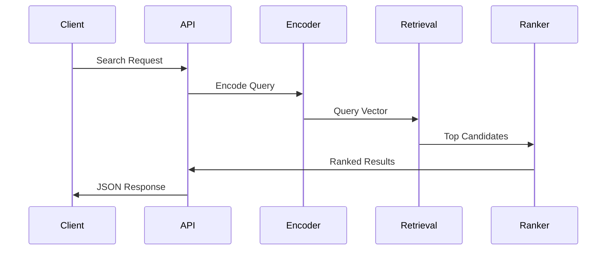

---

# REST Endpoints

## Search APIs

| Method | Endpoint           | Description     |
| ------ | ------------------ | --------------- |
| POST   | /api/search/text   | Text search     |
| POST   | /api/search/image  | Image search    |
| POST   | /api/search/hybrid | Hybrid search   |
| GET    | /api/products/{id} | Product details |
| GET    | /api/health        | Health status   |
| GET    | /api/version       | Service version |

---

# Text Search

### Request

```http
POST /api/search/text
Content-Type: application/json
```

```json
{
    "query": "white running shoes",
    "top_k": 20
}
```

---

### Response

```json
{
    "results": [
        {
            "product_id": 124,
            "title": "Nike Air Zoom",
            "score": 0.964,
            "price": 129.99,
            "brand": "Nike",
            "category": "Shoes"
        }
    ]
}
```

---

# Image Search

### Request

```http
POST /api/search/image
Content-Type: multipart/form-data
```

Parameters

| Field | Type    |
| ----- | ------- |
| image | File    |
| top_k | Integer |

---

# Hybrid Search

Hybrid search combines image and text embeddings before retrieval.

Example request

```json
{
    "query": "black leather backpack",
    "image": "uploaded_image.jpg",
    "top_k": 20
}
```

---

# Health Endpoint

```http
GET /api/health
```

Example response

```json
{
    "status":"healthy",
    "qdrant":"connected",
    "redis":"connected",
    "model":"loaded"
}
```

---

# Error Response

```json
{
    "error":"Invalid request",
    "status":400,
    "message":"Query cannot be empty."
}
```

---

# Request Validation

FastAPI automatically validates:

* Required fields
* Data types
* Maximum image size
* Maximum query length
* Pagination limits

---

# Frontend Overview

The web application is implemented using:

* Next.js App Router
* React
* Tailwind CSS
* TypeScript

Goals include:

* Fast navigation
* Responsive layout
* Mobile compatibility
* Accessible UI
* Progressive enhancement

---

# Frontend Folder Structure

```text
ui/

├── public/

├── src/

│   ├── app/

│   ├── components/

│   ├── hooks/

│   ├── lib/

│   ├── services/

│   ├── styles/

│   └── types/

├── package.json

└── next.config.js
```

---

# UI Components

Core components include:

| Component      | Purpose           |
| -------------- | ----------------- |
| SearchBar      | Text input        |
| ImageUploader  | Image selection   |
| ResultGrid     | Product grid      |
| ProductCard    | Product preview   |
| Filters        | Metadata filters  |
| Pagination     | Result navigation |
| LoadingSpinner | Async feedback    |
| ErrorBoundary  | Error handling    |

---

# Search Flow

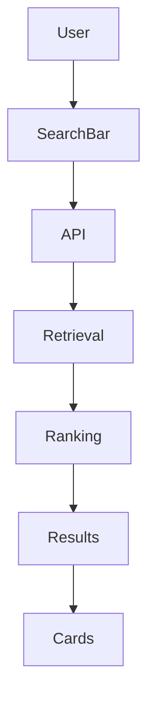

---

# State Management

Frontend state includes:

* Search query
* Uploaded image
* Active filters
* Loading state
* Pagination
* Selected product
* Recent searches

---

# Pagination

Default behavior:

| Property        | Value        |
| --------------- | ------------ |
| Default Results | 20           |
| Maximum Results | 100          |
| Page Size       | Configurable |

---

# Loading Strategy

The interface uses:

* Lazy loading
* Skeleton placeholders
* Image optimization
* Progressive rendering
* Infinite scrolling (optional)

---

# Responsive Design

Supported devices:

| Device  | Supported |
| ------- | --------- |
| Desktop | Yes       |
| Laptop  | Yes       |
| Tablet  | Yes       |
| Mobile  | Yes       |

---

# Accessibility

SearchForge follows common accessibility practices.

Features include:

* Keyboard navigation
* Semantic HTML
* Screen reader support
* High contrast compatibility
* Focus indicators
* Accessible forms

---

# Logging

Every API request records:

* Timestamp
* Request ID
* Endpoint
* Latency
* Status code
* Error details
* Client IP (optional)

---

# Monitoring

Metrics collected include:

* Requests per second
* Average latency
* Error rate
* Search latency
* Ranking latency
* Cache hit ratio

---

# OpenAPI Documentation

FastAPI automatically generates interactive documentation.

Available endpoints:

```text
/docs

/redoc
```

---

# API Performance Targets

| Metric           | Target  |
| ---------------- | ------- |
| API Latency      | <150 ms |
| Concurrent Users | 1,000+  |
| Uptime           | 99%     |
| P95 Latency      | <200 ms |
| Error Rate       | <1%     |

---

# Phase 4 Outputs

```text
src/api/
├── main.py
├── routes.py
├── middleware.py
├── schemas.py

ui/
├── app/
├── components/
├── services/

OpenAPI Documentation

Interactive Frontend

REST API

Health Endpoints
```

---

# End-to-End Request Lifecycle

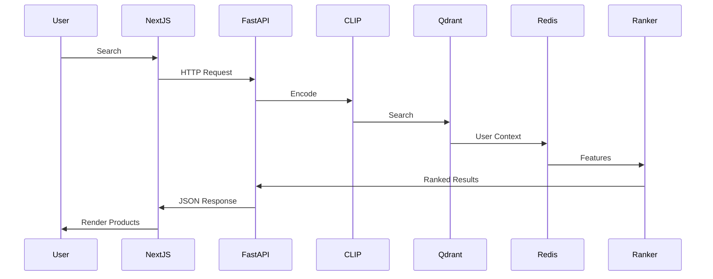

---

At the completion of Phase 4, SearchForge is fully operational as a production-ready multi-modal search platform with a scalable API, responsive frontend, interactive documentation, and an end-to-end latency target below **150 milliseconds**.


---

# Testing Strategy

SearchForge follows a **multi-layered testing strategy** to ensure correctness, reliability, and production readiness. Every layer of the application—from data ingestion to API responses—is tested independently and as part of an integrated pipeline.

The testing philosophy is based on four principles:

* Verify every component independently.
* Detect regressions automatically.
* Ensure reproducible ML pipelines.
* Validate production performance continuously.

---

# Testing Pyramid

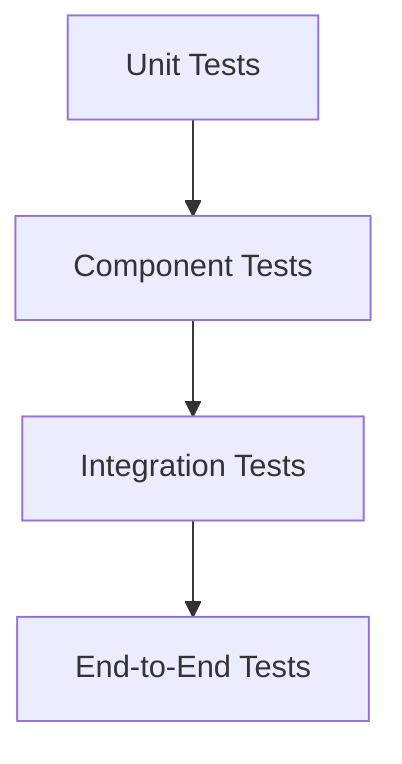

---

# Test Coverage

| Layer             | Purpose                          |
| ----------------- | -------------------------------- |
| Unit Tests        | Validate individual functions    |
| Component Tests   | Verify module interactions       |
| Integration Tests | Ensure subsystem compatibility   |
| API Tests         | Validate REST endpoints          |
| Performance Tests | Measure latency and throughput   |
| End-to-End Tests  | Simulate real user workflows     |
| Load Tests        | Verify scalability under traffic |
| Regression Tests  | Detect breaking changes          |

---

# Testing Directory

```text
tests/

├── api/
│   ├── test_search.py
│   ├── test_health.py
│   └── test_products.py
│
├── pipeline/
│   ├── test_loader.py
│   ├── test_embedding.py
│   └── test_ingestion.py
│
├── retrieval/
│   ├── test_qdrant.py
│   ├── test_filters.py
│   └── test_search.py
│
├── reranking/
│   ├── test_features.py
│   ├── test_ranker.py
│   └── test_inference.py
│
├── integration/
│   ├── test_pipeline.py
│   └── test_end_to_end.py
│
└── performance/
    ├── benchmark_api.py
    ├── benchmark_search.py
    └── benchmark_ranking.py
```

---

# Unit Testing

Each module is tested independently using **PyTest**.

Objectives:

* Verify business logic
* Validate utility functions
* Test edge cases
* Detect regressions
* Ensure deterministic outputs

Example:

```python
def test_cosine_similarity():
    vector_a = normalize([1, 2, 3])
    vector_b = normalize([1, 2, 3])

    assert cosine_similarity(vector_a, vector_b) == 1.0
```

---

# Integration Testing

Integration tests verify communication between components.

Examples include:

* CLIP → Qdrant
* FastAPI → Retrieval
* Retrieval → Ranking
* Redis → Ranking
* API → Frontend

These tests ensure that independently developed modules function correctly as a complete system.

---

# End-to-End Testing

End-to-end tests simulate complete user journeys.

Example workflow:

```text
Upload Image

↓

Generate Embedding

↓

ANN Retrieval

↓

Ranking

↓

JSON Response

↓

Frontend Rendering
```

The objective is to validate the complete search pipeline using realistic data.

---

# API Testing

API tests verify:

* Request validation
* Response schema
* Status codes
* Authentication
* Pagination
* Error handling
* Timeout behavior

Example command:

```bash
pytest tests/api
```

---

# ML Pipeline Validation

The embedding pipeline is verified for:

* Missing images
* Corrupted images
* Invalid metadata
* Empty descriptions
* Duplicate products
* Vector dimensions
* Embedding normalization

Expected output:

```text
✓ Catalog Loaded

✓ Images Downloaded

✓ Embeddings Generated

✓ Metadata Exported

✓ Validation Passed
```

---

# Vector Search Validation

Retrieval tests measure:

| Metric           | Target |
| ---------------- | ------ |
| Recall@100       | >95%   |
| Average Latency  | <50 ms |
| Index Integrity  | 100%   |
| Payload Accuracy | 100%   |

---

# Ranking Validation

The ranking engine is evaluated using historical interaction data.

Metrics include:

| Metric    | Target |
| --------- | ------ |
| NDCG@10   | >0.80  |
| MAP       | >0.75  |
| MRR       | >0.70  |
| Recall@20 | >0.90  |

---

# Performance Testing

Performance testing measures:

* API latency
* Retrieval latency
* Ranking latency
* Throughput
* Memory usage
* CPU utilization
* GPU utilization

Example benchmark:

```bash
pytest tests/performance
```

---

# Load Testing

SearchForge should remain stable under sustained traffic.

Target workload:

| Metric           | Target  |
| ---------------- | ------- |
| Concurrent Users | 1,000+  |
| Requests/Second  | 2,000+  |
| Average Response | <150 ms |
| Error Rate       | <1%     |

---

# Stress Testing

Stress tests intentionally exceed expected production load to determine:

* Maximum throughput
* Failure points
* Recovery time
* Resource saturation

Example progression:

```text
100 Users

↓

500 Users

↓

1,000 Users

↓

5,000 Users

↓

Recovery Analysis
```

---

# Regression Testing

Every pull request automatically executes regression tests to verify that new changes do not negatively impact existing functionality.

Covered areas include:

* Search quality
* API responses
* Embedding generation
* Ranking accuracy
* Frontend rendering

---

# Code Quality

The project enforces consistent code quality using automated tooling.

| Tool   | Purpose         |
| ------ | --------------- |
| Black  | Formatting      |
| Ruff   | Linting         |
| isort  | Import ordering |
| MyPy   | Static typing   |
| PyTest | Testing         |

Example:

```bash
black .

ruff check .

isort .

pytest
```

---

# Continuous Testing Workflow

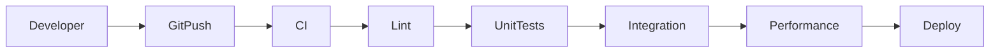

---

# Success Criteria

A build is considered production-ready when:

* All tests pass
* Code coverage exceeds **90%**
* Performance targets are met
* No critical security issues remain
* API contracts remain unchanged
* Benchmark regressions are within acceptable thresholds

---

# Quality Assurance Checklist

* Unit tests passing
* Integration tests passing
* API schema validated
* Embeddings verified
* Qdrant collections healthy
* Redis connectivity verified
* Ranking model loaded
* Frontend builds successfully
* Docker images build successfully
* Documentation updated

---

The testing strategy ensures that SearchForge remains reliable, reproducible, and scalable as new features and models are introduced.


---

# Performance Benchmarking

SearchForge is designed to provide consistent, low-latency semantic search at production scale. Every subsystem is benchmarked independently and as part of the complete inference pipeline.

Performance testing focuses on:

* End-to-end latency
* Throughput
* Memory utilization
* GPU utilization
* Search quality
* Scalability
* Reliability

---

# End-to-End Performance Goals

| Component                 |  Target |
| ------------------------- | ------: |
| Image Preprocessing       |  <10 ms |
| Text Preprocessing        |   <5 ms |
| CLIP Embedding Generation |  <30 ms |
| ANN Retrieval             |  <50 ms |
| Redis Feature Lookup      |   <5 ms |
| Feature Engineering       |   <8 ms |
| XGBoost Ranking           |  <10 ms |
| JSON Serialization        |   <5 ms |
| Total API Latency         | <150 ms |

---

# Benchmark Pipeline

```mermaid id="uq7wsi"
flowchart LR

Client

FastAPI

CLIP

Qdrant

Redis

Ranker

Response

Client --> FastAPI

FastAPI --> CLIP

CLIP --> Qdrant

Qdrant --> Redis

Redis --> Ranker

Ranker --> Response
```

---

# Latency Budget

The following illustrates the expected latency distribution for a typical search request.

| Stage                  |   Average |        P95 |        P99 |
| ---------------------- | --------: | ---------: | ---------: |
| Request Validation     |      2 ms |       4 ms |       6 ms |
| Query Encoding         |     24 ms |      30 ms |      35 ms |
| ANN Retrieval          |     32 ms |      45 ms |      55 ms |
| Redis Lookup           |      3 ms |       5 ms |       8 ms |
| Ranking                |      9 ms |      12 ms |      16 ms |
| Response Serialization |      4 ms |       6 ms |       8 ms |
| **Total**              | **74 ms** | **102 ms** | **128 ms** |

---

# Dataset Scaling Targets

| Dataset Size        | Expected Retrieval Latency |
| ------------------- | -------------------------: |
| 100K Products       |                     <20 ms |
| 500K Products       |                     <30 ms |
| 1 Million Products  |                     <40 ms |
| 5 Million Products  |                     <45 ms |
| 10 Million Products |                     <50 ms |

---

# Retrieval Quality Metrics

Performance is evaluated using both latency and search quality.

| Metric       | Target |
| ------------ | ------ |
| Recall@100   | >95%   |
| Precision@20 | >90%   |
| NDCG@10      | >0.80  |
| MAP          | >0.75  |
| MRR          | >0.70  |

---

# Throughput Targets

| Component          |                 Target |
| ------------------ | ---------------------: |
| Embedding Pipeline |    1,000 Images/minute |
| Vector Ingestion   |   100,000 Vectors/hour |
| Search Requests    | 2,000+ Requests/Second |
| Ranking Requests   | 2,000+ Requests/Second |

---

# Resource Utilization

Expected hardware utilization under sustained production load.

| Resource            | Target |
| ------------------- | -----: |
| CPU Usage           |   <75% |
| GPU Usage           |   >70% |
| Memory Usage        |   <80% |
| Disk I/O            | Stable |
| Network Utilization |   <70% |

---

# Benchmark Environment

| Component | Specification                     |
| --------- | --------------------------------- |
| CPU       | 8+ Cores                          |
| Memory    | 32 GB                             |
| GPU       | NVIDIA RTX 4090 / A100 (optional) |
| Storage   | NVMe SSD                          |
| OS        | Ubuntu 22.04 LTS                  |
| Python    | 3.11                              |

---

# Benchmark Methodology

Each benchmark follows the same procedure:

1. Warm up services.
2. Populate caches.
3. Execute repeated search requests.
4. Measure average latency.
5. Record P95 and P99 latency.
6. Compare against baseline.
7. Generate benchmark report.

---

# Benchmark Workflow

```mermaid id="j1qvl8"
flowchart TD

Warmup

GenerateQueries

ExecuteSearch

CollectMetrics

Analyze

ExportReport

Warmup --> GenerateQueries

GenerateQueries --> ExecuteSearch

ExecuteSearch --> CollectMetrics

CollectMetrics --> Analyze

Analyze --> ExportReport
```

---

# Search Quality Evaluation

Search quality is evaluated using representative query sets.

Example categories include:

* Fashion
* Electronics
* Home & Kitchen
* Books
* Furniture
* Beauty
* Sports
* Grocery

Each category contains:

* Text queries
* Image queries
* Hybrid queries

---

# Failure Benchmarks

The system is evaluated under degraded conditions to ensure graceful failure.

Scenarios include:

* Redis unavailable
* Qdrant unavailable
* CLIP model reload
* Network latency spikes
* High request concurrency
* Partial service failures

Expected behavior:

* Meaningful error messages
* Automatic retries where appropriate
* Fallback ranking
* No application crashes

---

# Memory Profile

Approximate production memory usage.

| Component     |            Memory |
| ------------- | ----------------: |
| FastAPI       |            300 MB |
| CLIP Model    |            1.2 GB |
| Redis         |            500 MB |
| Qdrant        | Dataset Dependent |
| XGBoost Model |             50 MB |

---

# GPU Performance

When GPU acceleration is available:

| Operation        |    Target |
| ---------------- | --------: |
| CLIP Inference   |    <30 ms |
| Batch Size       |        64 |
| Mixed Precision  |   Enabled |
| Device Selection | Automatic |

If no GPU is detected, SearchForge automatically falls back to optimized CPU inference.

---

# Continuous Benchmarking

Performance benchmarks are executed:

* Before releases
* After infrastructure changes
* After model updates
* During CI/CD validation
* On scheduled performance audits

Historical benchmark reports should be stored to monitor regressions over time.

---

# Benchmark Reports

Generated artifacts include:

```text id="bm1nqz"
reports/

├── benchmark_summary.md
├── latency_report.csv
├── throughput_report.csv
├── memory_profile.csv
├── gpu_profile.csv
├── retrieval_metrics.json
└── ranking_metrics.json
```

---

# Performance Optimization Checklist

* L2-normalized embeddings
* Batch inference enabled
* Async API endpoints
* Connection pooling
* Redis caching
* Payload indexing
* HNSW tuning
* Vector quantization
* Parallel ingestion
* Lazy loading
* Efficient JSON serialization
* Image optimization

---

# Production Readiness Criteria

SearchForge is considered production-ready when:

* API latency remains below **150 ms**
* Retrieval latency remains below **50 ms**
* Recall@100 exceeds **95%**
* P95 latency remains below **120 ms**
* Error rate remains below **1%**
* System maintains target throughput under expected production load
* Resource utilization remains within operational thresholds

---

The benchmarking framework enables continuous performance validation, ensuring SearchForge maintains low latency, high throughput, and consistent retrieval quality as the dataset and feature set evolve.


---

# Monitoring & Observability

A production-grade search platform requires continuous visibility into application health, infrastructure performance, model behavior, and user experience. SearchForge adopts a comprehensive observability strategy based on the **three pillars of observability**:

* Metrics
* Logs
* Traces

Together, these enable rapid issue detection, root-cause analysis, capacity planning, and performance optimization.

---

# Observability Architecture

```mermaid
flowchart LR

Users --> FastAPI

FastAPI --> Prometheus

FastAPI --> StructuredLogs

FastAPI --> OpenTelemetry

Qdrant --> Prometheus

Redis --> Prometheus

OpenTelemetry --> Jaeger

Prometheus --> Grafana

StructuredLogs --> Loki

Grafana --> Developer
```

---

# Monitoring Objectives

The monitoring stack is designed to answer questions such as:

* Is the API healthy?
* Is search latency increasing?
* Are Redis lookups slowing down?
* Is Qdrant overloaded?
* Are ranking models producing expected scores?
* Is GPU utilization healthy?
* Are users experiencing failures?

---

# Metrics Collection

Metrics are exposed through a Prometheus-compatible endpoint.

Example endpoint:

```text
GET /metrics
```

Collected metrics include:

* Request count
* Request duration
* Active requests
* Error count
* Cache hit ratio
* Search latency
* Ranking latency
* Embedding latency
* GPU utilization
* Memory usage

---

# API Metrics

| Metric             | Description               |
| ------------------ | ------------------------- |
| Requests/sec       | Incoming request rate     |
| Average Latency    | Mean response time        |
| P95 Latency        | 95th percentile latency   |
| P99 Latency        | Worst-case latency        |
| Error Rate         | Failed request percentage |
| Active Connections | Concurrent users          |

---

# Retrieval Metrics

Search performance is continuously monitored.

| Metric            | Description                  |
| ----------------- | ---------------------------- |
| Retrieval Latency | ANN search duration          |
| Recall@100        | Retrieval quality            |
| Collection Size   | Indexed vectors              |
| Search Throughput | Queries per second           |
| Filter Usage      | Metadata filtering frequency |

---

# Ranking Metrics

Machine learning metrics include:

| Metric               | Description            |
| -------------------- | ---------------------- |
| Ranking Latency      | XGBoost inference time |
| Average Score        | Mean ranking score     |
| Score Distribution   | Ranking consistency    |
| Feature Availability | Missing feature rate   |
| Personalization Rate | Personalized requests  |

---

# Infrastructure Metrics

Infrastructure monitoring covers:

* CPU utilization
* Memory consumption
* GPU utilization
* Disk usage
* Network throughput
* Container health
* Restart count

---

# Grafana Dashboards

Recommended dashboards include:

### API Dashboard

Displays:

* Requests per second
* Average latency
* Error rate
* Active sessions
* Endpoint usage

---

### Search Dashboard

Displays:

* Retrieval latency
* Search throughput
* Recall trends
* Collection growth
* Query distribution

---

### Ranking Dashboard

Displays:

* Ranking latency
* Average ranking score
* Feature availability
* Personalization usage
* Model version

---

### Infrastructure Dashboard

Displays:

* CPU
* RAM
* GPU
* Disk
* Containers
* Docker health
* Network traffic

---

# Structured Logging

All services emit structured JSON logs.

Example log entry:

```json
{
    "timestamp":"2026-01-10T14:32:10Z",
    "request_id":"f34ab981",
    "endpoint":"/api/search/text",
    "latency_ms":82,
    "status":200,
    "user_id":"anonymous",
    "model_version":"v1.0.0"
}
```

---

# Log Levels

| Level    | Purpose                 |
| -------- | ----------------------- |
| DEBUG    | Development diagnostics |
| INFO     | Normal operations       |
| WARNING  | Recoverable issues      |
| ERROR    | Failed requests         |
| CRITICAL | System failures         |

---

# Distributed Tracing

OpenTelemetry traces every request across the system.

Example trace flow:

```text
User Request

↓

FastAPI

↓

CLIP Encoder

↓

Qdrant

↓

Redis

↓

Ranker

↓

Response
```

Tracing allows engineers to identify which subsystem contributes most to request latency.

---

# Health Checks

Each service exposes a lightweight health endpoint.

| Service  | Endpoint               |
| -------- | ---------------------- |
| API      | `/health`              |
| Qdrant   | Native health endpoint |
| Redis    | PING command           |
| Frontend | `/`                    |

Example response:

```json
{
    "status": "healthy",
    "services": {
        "api": "healthy",
        "redis": "healthy",
        "qdrant": "healthy",
        "ranker": "loaded"
    }
}
```

---

# Alerting Strategy

Critical alerts should be configured for:

* API unavailable
* Qdrant unavailable
* Redis unavailable
* Error rate >5%
* API latency >200 ms
* Retrieval latency >75 ms
* GPU utilization <20%
* Disk usage >90%
* Memory usage >90%

---

# Suggested Alert Thresholds

| Metric       | Threshold    |
| ------------ | ------------ |
| API Latency  | >200 ms      |
| Error Rate   | >5%          |
| Memory Usage | >90%         |
| CPU Usage    | >85%         |
| GPU Usage    | <20% or >95% |
| Disk Usage   | >90%         |

---

# Request Correlation

Every incoming request receives a unique correlation ID.

Example:

```text
Request ID

↓

API

↓

Retrieval

↓

Ranking

↓

Logs

↓

Metrics

↓

Trace
```

This simplifies debugging across distributed services.

---

# Model Monitoring

Model-specific metrics include:

* Average embedding norm
* Embedding generation time
* Ranking score drift
* Feature drift
* Prediction distribution
* Model version
* Inference failures

---

# Business Metrics

Operational success is measured alongside technical metrics.

Example KPIs:

| KPI                      | Purpose         |
| ------------------------ | --------------- |
| Click-Through Rate       | User engagement |
| Conversion Rate          | Business impact |
| Average Session Duration | User retention  |
| Zero Result Searches     | Search quality  |
| Popular Queries          | Trend analysis  |
| Search Abandonment Rate  | UX quality      |

---

# Dashboard Layout

```mermaid
flowchart LR

Overview

API

Retrieval

Ranking

Infrastructure

Business

Overview --> API

Overview --> Retrieval

Overview --> Ranking

Overview --> Infrastructure

Overview --> Business
```

---

# Observability Stack

| Component     | Technology    |
| ------------- | ------------- |
| Metrics       | Prometheus    |
| Dashboards    | Grafana       |
| Logs          | Loki          |
| Tracing       | OpenTelemetry |
| Trace Storage | Jaeger        |
| Alerting      | Alertmanager  |

---

# Monitoring Checklist

* API metrics enabled
* Prometheus scraping configured
* Grafana dashboards deployed
* Structured logging enabled
* OpenTelemetry instrumentation added
* Health checks implemented
* Alerts configured
* Model metrics exported
* Infrastructure dashboards available
* Business KPIs monitored

---

# Production Operations

Recommended operational practices:

* Review dashboards daily.
* Investigate latency regressions immediately.
* Archive benchmark reports after each release.
* Monitor model performance following deployments.
* Rotate logs regularly.
* Test alerting rules periodically.
* Validate health checks after infrastructure changes.

---

By combining metrics, logs, and distributed traces, SearchForge provides complete operational visibility across the retrieval, ranking, and API layers, enabling rapid diagnosis and reliable production operations.


---

# Security Architecture

SearchForge is designed with a **defense-in-depth** security model. Every layer of the application—from the frontend to the vector database—is protected using authentication, authorization, encryption, validation, and secure operational practices.

Security objectives include:

* Protect user data
* Prevent unauthorized access
* Secure ML models
* Defend APIs
* Protect infrastructure
* Ensure supply-chain integrity
* Support secure deployments

---

# Security Principles

The project follows several core principles:

* Least privilege
* Zero trust
* Secure by default
* Defense in depth
* Fail securely
* Principle of minimal exposure
* Continuous monitoring

---

# Security Architecture

```mermaid
flowchart LR

User

CDN

NextJS

API

Authentication

Authorization

CLIP

Qdrant

Redis

Logs

Monitoring

User --> CDN

CDN --> NextJS

NextJS --> API

API --> Authentication

Authentication --> Authorization

Authorization --> CLIP

Authorization --> Qdrant

Authorization --> Redis

API --> Logs

Logs --> Monitoring
```

---

# Authentication

Authentication can be implemented using:

| Method          | Recommended       |
| --------------- | ----------------- |
| JWT             | Yes               |
| OAuth2          | Yes               |
| OpenID Connect  | Yes               |
| API Keys        | Internal Services |
| Session Cookies | Optional          |

JWT bearer authentication is recommended for production deployments.

---

# Authorization

Role-based access control (RBAC) separates permissions across users.

Example roles:

| Role            | Permissions             |
| --------------- | ----------------------- |
| Guest           | Search only             |
| User            | Search + Saved Searches |
| Moderator       | Catalog moderation      |
| Administrator   | Full system access      |
| Service Account | Internal APIs           |

---

# API Security

Every API endpoint should implement:

* Request validation
* Authentication
* Authorization
* Rate limiting
* Request logging
* Timeout protection
* Input sanitization

---

# HTTPS

Production deployments should enforce HTTPS.

Recommended settings:

* TLS 1.3
* Strong cipher suites
* HSTS enabled
* Secure cookies
* Automatic certificate renewal

---

# Secrets Management

Secrets must never be committed to the repository.

Examples include:

* API keys
* Database passwords
* Redis passwords
* JWT signing keys
* OAuth secrets
* Cloud credentials

Recommended storage:

* Docker Secrets
* Kubernetes Secrets
* HashiCorp Vault
* Cloud Secret Managers

---

# Environment Variables

Example:

```env
JWT_SECRET=********

REDIS_PASSWORD=********

QDRANT_API_KEY=********

OPENAI_API_KEY=********
```

---

# Input Validation

Every request is validated before processing.

Validation includes:

* Required fields
* Data types
* Maximum payload size
* Allowed MIME types
* Maximum image resolution
* Query length
* Pagination limits

---

# File Upload Security

Uploaded images should undergo validation before inference.

Validation pipeline:

```text
Upload

↓

Content-Type Validation

↓

File Size Check

↓

Image Decoding

↓

Virus Scan (Optional)

↓

CLIP Processing
```

Rejected uploads include:

* Corrupted files
* Unsupported formats
* Oversized files
* Executable content
* Invalid MIME types

---

# Supported Image Formats

| Format | Supported |
| ------ | --------- |
| PNG    | Yes       |
| JPEG   | Yes       |
| JPG    | Yes       |
| WEBP   | Yes       |

Maximum recommended upload size:

```text
10 MB
```

---

# Rate Limiting

Rate limiting prevents abuse.

Suggested limits:

| Endpoint        | Limit               |
| --------------- | ------------------- |
| Search API      | 100 requests/minute |
| Image Search    | 30 requests/minute  |
| Authentication  | 10 requests/minute  |
| Health Endpoint | Unlimited           |

---

# Security Headers

Recommended HTTP headers:

| Header                    | Purpose              |
| ------------------------- | -------------------- |
| Content-Security-Policy   | Prevent XSS          |
| X-Frame-Options           | Prevent clickjacking |
| X-Content-Type-Options    | MIME protection      |
| Referrer-Policy           | Privacy              |
| Strict-Transport-Security | HTTPS enforcement    |

---

# Cross-Origin Resource Sharing (CORS)

Only trusted frontend origins should be allowed.

Example configuration:

```text
https://searchforge.ai

https://dashboard.searchforge.ai
```

Avoid using wildcard (`*`) origins in production.

---

# Dependency Security

Dependencies should be audited regularly.

Recommended tools:

| Tool       | Purpose            |
| ---------- | ------------------ |
| pip-audit  | Python packages    |
| npm audit  | Frontend packages  |
| Dependabot | Automated updates  |
| Trivy      | Container scanning |

---

# Container Security

Docker images should follow best practices.

Recommendations:

* Minimal base images
* Non-root user
* Read-only filesystem (where possible)
* Multi-stage builds
* Remove unused packages
* Pin dependency versions

---

# Docker Security Checklist

* Non-root container
* HEALTHCHECK configured
* Minimal image size
* Environment variables externalized
* Secrets not embedded
* Image scanned before deployment

---

# Data Protection

Sensitive information should be protected both in transit and at rest.

Recommendations:

* TLS encryption
* Disk encryption
* Database encryption
* Secure backups
* Key rotation
* Access logging

---

# Logging Security

Never log:

* Passwords
* JWT tokens
* API keys
* OAuth tokens
* Session cookies
* Credit card information
* Personally identifiable information (PII)

Logs should include only operational metadata necessary for debugging.

---

# Redis Security

Recommended configuration:

* Password authentication
* Protected mode enabled
* Internal network access only
* TLS enabled (where supported)
* Periodic backups

---

# Qdrant Security

Production recommendations:

* API authentication
* TLS termination
* Private network deployment
* Snapshot encryption
* Access logging

---

# Model Security

Protect ML assets by:

* Versioning trained models
* Verifying model integrity
* Restricting write access
* Storing checksums
* Maintaining immutable releases

---

# Supply Chain Security

The CI/CD pipeline should verify:

* Dependency signatures
* Container images
* Package vulnerabilities
* License compliance
* Static analysis results

---

# Security Monitoring

Continuously monitor:

* Authentication failures
* Permission denials
* Rate-limit violations
* Unexpected traffic spikes
* API abuse
* Container restarts
* Privilege escalation attempts

---

# Backup Strategy

Critical assets requiring backup:

* Qdrant snapshots
* Redis persistence
* Trained models
* Configuration files
* Environment templates
* Benchmark reports

Suggested schedule:

| Asset           | Frequency      |
| --------------- | -------------- |
| Qdrant Snapshot | Daily          |
| Redis Backup    | Daily          |
| Models          | After Training |
| Configurations  | Every Release  |

---

# Incident Response

If a security incident occurs:

1. Detect the issue.
2. Isolate affected services.
3. Preserve logs and evidence.
4. Rotate compromised credentials.
5. Restore from verified backups.
6. Validate system integrity.
7. Publish a post-incident report.

---

# Security Checklist

* HTTPS enabled
* JWT authentication configured
* RBAC implemented
* Rate limiting enabled
* Secrets externalized
* Input validation complete
* Secure file uploads
* Dependency scanning enabled
* Container scanning enabled
* Vulnerability monitoring configured
* Backup strategy documented
* Audit logging enabled

---

# Security Roadmap

Future improvements include:

* Multi-factor authentication (MFA)
* Single Sign-On (SSO)
* Web Application Firewall (WAF)
* Hardware Security Modules (HSM)
* Confidential Computing
* Runtime threat detection
* Policy-as-Code enforcement
* Automated security compliance reporting

---

SearchForge's security architecture is designed to support production deployments by combining secure software engineering practices, infrastructure hardening, continuous monitoring, and proactive vulnerability management.


---

# CI/CD Pipeline

SearchForge uses a production-oriented Continuous Integration and Continuous Deployment (CI/CD) workflow to automate code validation, testing, packaging, and deployment.

The pipeline is designed to:

* Detect regressions early
* Maintain consistent code quality
* Automate testing
* Build reproducible Docker images
* Reduce deployment risk
* Enable frequent releases

---

# CI/CD Objectives

The pipeline ensures every change:

* Passes automated validation
* Meets quality standards
* Produces reproducible builds
* Can be deployed safely
* Is fully traceable

---

# Pipeline Overview

```mermaid
flowchart LR

Developer

GitHub

CI

Lint

Tests

Build

Docker

Registry

CD

Production

Developer --> GitHub

GitHub --> CI

CI --> Lint

Lint --> Tests

Tests --> Build

Build --> Docker

Docker --> Registry

Registry --> CD

CD --> Production
```

---

# Development Workflow

```text
Create Feature Branch

↓

Implement Feature

↓

Run Local Tests

↓

Commit Changes

↓

Open Pull Request

↓

Code Review

↓

Merge to Main

↓

Automatic Deployment
```

---

# Git Branch Strategy

| Branch    | Purpose                    |
| --------- | -------------------------- |
| main      | Stable production code     |
| develop   | Integration branch         |
| feature/* | New features               |
| bugfix/*  | Bug fixes                  |
| hotfix/*  | Emergency production fixes |
| release/* | Release preparation        |

---

# Pull Request Workflow

Every pull request automatically executes:

* Dependency installation
* Static analysis
* Formatting verification
* Unit tests
* Integration tests
* API tests
* Performance smoke tests
* Docker build verification

Only successful pull requests may be merged.

---

# CI Pipeline Stages

## Stage 1 — Checkout

Retrieve repository source code.

```yaml
uses: actions/checkout@v4
```

---

## Stage 2 — Environment Setup

Install:

* Python
* Node.js
* Dependencies
* System packages

---

## Stage 3 — Static Analysis

Execute:

* Ruff
* Black
* isort
* MyPy

Example:

```bash
ruff check .

black --check .

isort --check-only .

mypy src
```

---

## Stage 4 — Automated Testing

Execute the complete test suite.

```bash
pytest
```

Coverage reports are automatically generated.

---

## Stage 5 — Security Scanning

Run automated security tools.

Recommended tools:

| Tool      | Purpose                      |
| --------- | ---------------------------- |
| pip-audit | Python dependency audit      |
| npm audit | Frontend dependency audit    |
| Trivy     | Container vulnerability scan |
| CodeQL    | Static security analysis     |

---

## Stage 6 — Docker Build

Both backend and frontend images are built.

```bash
docker build -f Dockerfile.api .

docker build -f Dockerfile.ui .
```

Images must build successfully before deployment continues.

---

## Stage 7 — Integration Tests

Launch temporary infrastructure.

Components:

* FastAPI
* Redis
* Qdrant

Execute end-to-end API validation.

---

## Stage 8 — Artifact Generation

Artifacts produced include:

```text
coverage.xml

test-report.xml

benchmark-report.json

docker-images

release-notes.md
```

Artifacts are archived for every successful build.

---

# CD Pipeline

After approval, deployment proceeds automatically.

Deployment stages:

```text
Container Registry

↓

Staging

↓

Smoke Tests

↓

Production

↓

Health Checks

↓

Traffic Switch
```

---

# Deployment Strategy

Supported deployment strategies:

| Strategy              | Recommended      |
| --------------------- | ---------------- |
| Rolling Deployment    | Yes              |
| Blue-Green Deployment | Yes              |
| Canary Deployment     | Recommended      |
| Recreate              | Development Only |

---

# Environment Promotion

```mermaid
flowchart LR

Development

Testing

Staging

Production

Development --> Testing

Testing --> Staging

Staging --> Production
```

Each promotion requires:

* Passing tests
* Security approval
* Successful health checks

---

# Release Versioning

Semantic Versioning (SemVer) is recommended.

Examples:

```text
v1.0.0

v1.1.0

v1.2.5

v2.0.0
```

Rules:

* Major → Breaking changes
* Minor → New features
* Patch → Bug fixes

---

# Docker Image Versioning

Images should be tagged with:

```text
latest

v1.0.0

v1.1.0

commit-sha
```

Avoid deploying `latest` directly in production.

---

# Rollback Strategy

Every deployment must support rollback.

Rollback triggers include:

* Increased latency
* High error rate
* Failed health checks
* Failed smoke tests
* Infrastructure instability

Rollback procedure:

```text
Detect Failure

↓

Stop Deployment

↓

Restore Previous Image

↓

Validate Health

↓

Resume Traffic
```

---

# Smoke Testing

Immediately after deployment, execute:

* Health endpoint
* Search endpoint
* Image search
* Hybrid search
* Redis connectivity
* Qdrant connectivity
* Ranking inference

Expected completion time:

```text
< 2 minutes
```

---

# Deployment Checklist

Before every production deployment:

* Code reviewed
* Tests passing
* Benchmarks verified
* Security scan passed
* Docker images built
* Documentation updated
* Release notes prepared
* Version tagged

---

# GitHub Actions Workflow

Example workflow structure:

```text
.github/

└── workflows/

    ├── ci.yml

    ├── cd.yml

    ├── benchmark.yml

    ├── security.yml

    └── release.yml
```

---

# Build Matrix

Recommended build targets:

| Platform | Supported |
| -------- | --------- |
| Ubuntu   | Yes       |
| Windows  | Yes       |
| macOS    | Yes       |

Python versions:

* 3.11
* 3.12

---

# Release Artifacts

Every release publishes:

* Docker images
* Release notes
* Test reports
* Coverage reports
* Benchmark reports
* Model metadata
* Version manifest

---

# Pipeline Metrics

Monitor the CI/CD process using:

| Metric                  | Target  |
| ----------------------- | ------- |
| Build Success Rate      | >98%    |
| Average Build Time      | <10 min |
| Deployment Success Rate | >99%    |
| Rollback Frequency      | <2%     |
| Test Coverage           | >90%    |

---

# Continuous Delivery Checklist

* Automated builds
* Automated tests
* Automated security scans
* Automated Docker builds
* Versioned releases
* Staging validation
* Production health checks
* Rollback support
* Deployment notifications
* Release documentation

---

# CI/CD Best Practices

* Keep builds deterministic.
* Cache dependencies where appropriate.
* Version all artifacts.
* Treat infrastructure as code.
* Automate repetitive tasks.
* Fail fast on validation errors.
* Never bypass automated testing.
* Deploy frequently with small, incremental changes.

---

The CI/CD pipeline enables SearchForge to move from development to production through a repeatable, automated, and verifiable workflow while maintaining high software quality and operational reliability.


---

# Containerization & Deployment

SearchForge is designed as a **cloud-native**, container-first application. Every major component is isolated into independent services, enabling reproducible local development, scalable production deployments, and simplified infrastructure management.

The deployment architecture emphasizes:

* Service isolation
* Horizontal scalability
* Fault tolerance
* Easy upgrades
* Infrastructure portability
* Cloud compatibility

---

# Deployment Architecture

```mermaid
flowchart TB

Developer["Developer"]

GitHub["GitHub Repository"]

Registry["Container Registry"]

LB["Load Balancer"]

Frontend["Next.js"]

API["FastAPI"]

Redis["Redis"]

Qdrant["Qdrant"]

Storage["Persistent Storage"]

Monitoring["Monitoring Stack"]

Developer --> GitHub

GitHub --> Registry

Registry --> LB

LB --> Frontend

LB --> API

API --> Redis

API --> Qdrant

Qdrant --> Storage

API --> Monitoring
```

---

# Container Overview

Each service has a single responsibility.

| Container     | Responsibility             |
| ------------- | -------------------------- |
| Frontend      | Next.js application        |
| Backend       | FastAPI search service     |
| Redis         | Feature cache              |
| Qdrant        | Vector database            |
| Monitoring    | Metrics & dashboards       |
| Reverse Proxy | Traffic routing (optional) |

---

# Docker Compose Architecture

```mermaid
flowchart LR

Browser

NextJS

FastAPI

Redis

Qdrant

Browser --> NextJS

NextJS --> FastAPI

FastAPI --> Redis

FastAPI --> Qdrant
```

---

# Recommended Project Layout

```text
deployment/

├── docker/
│   ├── Dockerfile.api
│   ├── Dockerfile.ui
│   └── Dockerfile.monitoring
│
├── compose/
│   ├── docker-compose.yml
│   ├── docker-compose.dev.yml
│   └── docker-compose.prod.yml
│
├── kubernetes/
│   ├── namespace.yaml
│   ├── api.yaml
│   ├── frontend.yaml
│   ├── redis.yaml
│   ├── qdrant.yaml
│   ├── ingress.yaml
│   └── hpa.yaml
│
└── scripts/
    ├── deploy.sh
    ├── backup.sh
    └── restore.sh
```

---

# Docker Images

Recommended image naming convention:

| Image      | Example                        |
| ---------- | ------------------------------ |
| API        | `searchforge-api:1.0.0`        |
| Frontend   | `searchforge-ui:1.0.0`         |
| Monitoring | `searchforge-monitoring:1.0.0` |

---

# Multi-Stage Docker Builds

Multi-stage builds reduce image size.

Example stages:

```text
Base Image

↓

Install Dependencies

↓

Build Application

↓

Production Runtime
```

Benefits:

* Smaller images
* Faster deployments
* Reduced attack surface
* Better cache utilization

---

# Container Resource Allocation

Recommended limits:

| Service  |    CPU | Memory |
| -------- | -----: | -----: |
| API      | 2 vCPU |   4 GB |
| Frontend | 1 vCPU |   1 GB |
| Redis    | 1 vCPU |   2 GB |
| Qdrant   | 4 vCPU |   8 GB |

Production values should be tuned using workload benchmarks.

---

# Networking

Internal communication occurs over a private container network.

```text
Internet

↓

Load Balancer

↓

Frontend

↓

Backend

↓

Redis / Qdrant
```

Only the frontend and API should be publicly accessible.

---

# Persistent Storage

Persistent volumes should be used for:

| Service | Persistent Data      |
| ------- | -------------------- |
| Qdrant  | Vector collections   |
| Redis   | Optional persistence |
| Logs    | Application logs     |
| Models  | Trained ML models    |

---

# Environment Separation

Each environment maintains independent resources.

| Environment | Purpose                     |
| ----------- | --------------------------- |
| Development | Local feature development   |
| Testing     | Automated validation        |
| Staging     | Pre-production verification |
| Production  | Live deployment             |

Configuration should never be shared across environments.

---

# Health Checks

Every container exposes a health endpoint.

Example lifecycle:

```mermaid
stateDiagram-v2

[*] --> Starting

Starting --> Healthy

Healthy --> Unhealthy

Unhealthy --> Restarting

Restarting --> Healthy
```

Health checks enable automatic restart of failed services.

---

# Kubernetes Deployment

For large-scale deployments, Kubernetes provides orchestration.

Core components:

| Resource   | Purpose                 |
| ---------- | ----------------------- |
| Namespace  | Environment isolation   |
| Deployment | Replica management      |
| Service    | Internal networking     |
| Ingress    | External routing        |
| ConfigMap  | Configuration           |
| Secret     | Sensitive configuration |
| HPA        | Horizontal scaling      |
| PVC        | Persistent storage      |

---

# Kubernetes Architecture

```mermaid
flowchart TB

Internet

Ingress

FrontendPods["Frontend Pods"]

APIPods["API Pods"]

Redis

Qdrant

PVC["Persistent Volumes"]

Internet --> Ingress

Ingress --> FrontendPods

Ingress --> APIPods

APIPods --> Redis

APIPods --> Qdrant

Qdrant --> PVC
```

---

# Horizontal Scaling

The backend is stateless, allowing horizontal scaling.

```text
1 API Pod

↓

2 API Pods

↓

5 API Pods

↓

10+ API Pods
```

Scaling is based on:

* CPU utilization
* Request rate
* Queue depth
* Response latency

---

# Auto Scaling

Suggested HPA configuration:

| Metric       | Threshold    |
| ------------ | ------------ |
| CPU          | 70%          |
| Memory       | 75%          |
| Requests/sec | Configurable |

Minimum replicas:

```text
2
```

Maximum replicas:

```text
20
```

---

# Load Balancing

Requests are distributed across API replicas.

Supported algorithms:

* Round Robin
* Least Connections
* Weighted Round Robin

The choice depends on infrastructure and traffic patterns.

---

# Backup Strategy

Critical assets requiring scheduled backups:

* Vector database
* Redis snapshots
* Model artifacts
* Configuration
* Environment templates

Suggested schedule:

| Asset           | Frequency      |
| --------------- | -------------- |
| Qdrant Snapshot | Daily          |
| Redis Snapshot  | Daily          |
| Models          | After Training |
| Configuration   | Every Release  |

---

# Disaster Recovery

Recovery workflow:

```text
Infrastructure Failure

↓

Provision Resources

↓

Restore Containers

↓

Restore Qdrant Snapshot

↓

Restore Redis

↓

Restore Models

↓

Health Verification

↓

Resume Traffic
```

Target recovery objectives:

| Metric                         | Target      |
| ------------------------------ | ----------- |
| RTO (Recovery Time Objective)  | <30 minutes |
| RPO (Recovery Point Objective) | <24 hours   |

---

# Deployment Validation

Every deployment should verify:

* API availability
* Frontend availability
* Redis connectivity
* Qdrant connectivity
* Model loading
* Search functionality
* Ranking functionality
* Monitoring endpoints

---

# Production Readiness Checklist

* Docker images versioned
* Containers scanned for vulnerabilities
* Secrets externalized
* Health checks enabled
* Resource limits configured
* Persistent volumes mounted
* Backups scheduled
* Monitoring deployed
* Alerts configured
* Auto-scaling enabled
* Rollback strategy documented

---

# Deployment Targets

SearchForge is designed to support multiple deployment environments.

| Platform                 | Supported |
| ------------------------ | --------- |
| Local Docker             | Yes       |
| Docker Compose           | Yes       |
| Kubernetes               | Yes       |
| AWS ECS                  | Yes       |
| Azure Container Apps     | Yes       |
| Google Kubernetes Engine | Yes       |
| Self-Hosted Kubernetes   | Yes       |
| On-Premises Docker       | Yes       |

---

# Infrastructure Principles

The deployment architecture follows these principles:

* Immutable infrastructure
* Infrastructure as Code (IaC)
* Stateless application services
* Automated scaling
* High availability
* Secure networking
* Reproducible deployments
* Cloud portability

---

This deployment architecture enables SearchForge to run consistently across local development, staging, and production environments while supporting high availability, scalable infrastructure, and cloud-native operational practices.


---

# Scalability & Performance Engineering

SearchForge is designed to scale from **thousands** to **tens of millions** of products without requiring architectural redesign. Every subsystem is independently scalable, allowing compute resources to be allocated according to workload characteristics.

The platform follows a **shared-nothing, horizontally scalable architecture**, where stateless services can be replicated independently while stateful services use dedicated clustering or replication strategies.

---

# Scalability Goals

| Metric           |          Target |
| ---------------- | --------------: |
| Indexed Products |            10M+ |
| Concurrent Users |         10,000+ |
| Search Requests  | 2,000–5,000 QPS |
| API Availability |           99.9% |
| P95 API Latency  |         <150 ms |
| Vector Recall    |            >95% |

---

# Scalability Architecture

```mermaid id="5l8kqv"
flowchart TB

Internet

CDN

LoadBalancer

Frontend1["Next.js Pod"]

Frontend2["Next.js Pod"]

API1["FastAPI Pod"]

API2["FastAPI Pod"]

API3["FastAPI Pod"]

RedisCluster["Redis Cluster"]

QdrantCluster["Qdrant Cluster"]

ObjectStorage["Object Storage"]

Internet --> CDN

CDN --> LoadBalancer

LoadBalancer --> Frontend1
LoadBalancer --> Frontend2

Frontend1 --> API1
Frontend1 --> API2
Frontend2 --> API2
Frontend2 --> API3

API1 --> RedisCluster
API2 --> RedisCluster
API3 --> RedisCluster

API1 --> QdrantCluster
API2 --> QdrantCluster
API3 --> QdrantCluster

QdrantCluster --> ObjectStorage
```

---

# Scaling Philosophy

Each subsystem should scale independently.

| Service            | Scaling Method      |
| ------------------ | ------------------- |
| Frontend           | Horizontal replicas |
| FastAPI            | Horizontal replicas |
| Redis              | Cluster / Sentinel  |
| Qdrant             | Distributed cluster |
| Embedding Pipeline | Distributed workers |
| Training Pipeline  | GPU workers         |

---

# Frontend Scaling

The frontend is completely stateless.

Benefits:

* Infinite horizontal scaling
* CDN caching
* Zero shared session state
* Easy blue-green deployment

Recommended deployment:

```text id="7skvpf"
Load Balancer

↓

4 Frontend Pods

↓

Static Assets via CDN
```

---

# Backend Scaling

FastAPI services remain stateless.

Scaling triggers:

* CPU utilization
* Request rate
* Queue length
* Response latency

Recommended replica counts:

| Traffic Level     | API Replicas |
| ----------------- | -----------: |
| Development       |            1 |
| Small Production  |            2 |
| Medium Production |            5 |
| Large Production  |          10+ |

---

# Embedding Pipeline Scaling

Embedding generation is computationally expensive.

Pipeline parallelism is achieved through worker pools.

```mermaid id="p94wly"
flowchart LR

Catalog

Queue

GPUWorker1

GPUWorker2

GPUWorker3

Embeddings

Catalog --> Queue

Queue --> GPUWorker1
Queue --> GPUWorker2
Queue --> GPUWorker3

GPUWorker1 --> Embeddings
GPUWorker2 --> Embeddings
GPUWorker3 --> Embeddings
```

---

# Vector Database Scaling

Qdrant collections can be distributed across multiple nodes.

Scaling dimensions include:

* Sharding
* Replication
* Payload indexing
* Quantization
* Snapshot distribution

---

# Qdrant Cluster

```text id="mbxyi5"
Router

↓

Shard 1

Shard 2

Shard 3

↓

Replicas
```

Benefits:

* Higher throughput
* Fault tolerance
* Larger datasets
* Improved availability

---

# Redis Scaling

Redis supports several deployment modes.

| Mode       | Use Case               |
| ---------- | ---------------------- |
| Standalone | Development            |
| Sentinel   | High availability      |
| Cluster    | Large-scale production |

Recommended production architecture:

```text id="ruvjg4"
Redis Primary

↓

Replica 1

Replica 2

↓

Automatic Failover
```

---

# Caching Strategy

Caching significantly reduces response latency.

Cached objects include:

* Query embeddings
* Popular search results
* Product metadata
* User features
* Filter metadata

---

# Cache Layers

```mermaid id="0xj4ns"
flowchart TD

BrowserCache

CDN

Redis

Qdrant

BrowserCache --> CDN

CDN --> Redis

Redis --> Qdrant
```

---

# Search Optimization

Techniques used to maintain low latency:

* Vector normalization
* HNSW indexing
* Connection pooling
* Batch inference
* Metadata indexing
* Async request handling
* Query caching
* Compression

---

# Model Optimization

Inference performance is improved using:

* Mixed precision
* Batch processing
* Torch compilation (optional)
* Model warm-up
* CPU fallback
* GPU auto-selection

---

# Database Optimization

Qdrant configuration recommendations:

| Parameter    | Recommended |
| ------------ | ----------: |
| M            |          16 |
| ef_construct |         100 |
| ef_search    |         128 |
| Distance     |      Cosine |

Indexes should be rebuilt after major catalog updates.

---

# Network Optimization

Recommendations:

* Enable HTTP/2
* Use gzip or Brotli compression
* Keep-alive connections
* CDN for static assets
* Persistent backend connections

---

# Resource Optimization

CPU-intensive workloads:

* Request validation
* Ranking
* Serialization

GPU-intensive workloads:

* CLIP inference
* Batch embedding generation

Memory-intensive workloads:

* Qdrant indexes
* Redis cache
* Metadata storage

---

# Capacity Planning

Example production sizing.

| Catalog Size  | Recommended Infrastructure |
| ------------- | -------------------------- |
| 100K Products | 1 API + 1 Qdrant           |
| 1M Products   | 2 APIs + 2 Qdrant Nodes    |
| 5M Products   | 5 APIs + 3 Qdrant Nodes    |
| 10M+ Products | Kubernetes Cluster         |

Actual sizing depends on traffic patterns and hardware specifications.

---

# High Availability

High availability is achieved through:

* Multiple API replicas
* Redis replication
* Qdrant replication
* Health checks
* Automatic restart
* Rolling deployments

---

# Failure Isolation

Each subsystem can fail independently.

Examples:

| Failure          | System Behavior                 |
| ---------------- | ------------------------------- |
| Redis Offline    | Disable personalization         |
| Qdrant Restart   | Retry search requests           |
| Frontend Failure | Restart container               |
| API Failure      | Load balancer redirects traffic |

Graceful degradation ensures that a single component failure does not render the entire application unavailable.

---

# Disaster Recovery Strategy

Critical assets:

* Vector collections
* Trained models
* Configuration
* Container images
* Monitoring configuration

Recovery process:

```text id="w1jv9h"
Restore Infrastructure

↓

Restore Storage

↓

Restore Qdrant

↓

Restore Redis

↓

Deploy API

↓

Deploy Frontend

↓

Health Verification
```

---

# Growth Roadmap

Projected infrastructure evolution.

| Stage      | Deployment              |
| ---------- | ----------------------- |
| Prototype  | Docker Compose          |
| MVP        | Single VM               |
| Beta       | Multi-VM                |
| Production | Kubernetes              |
| Enterprise | Multi-Region Kubernetes |

---

# Multi-Region Architecture

Future enterprise deployments may include:

```mermaid id="m0oh9t"
flowchart LR

Users

GlobalLB["Global Load Balancer"]

RegionA["Region A"]

RegionB["Region B"]

Users --> GlobalLB

GlobalLB --> RegionA

GlobalLB --> RegionB
```

Benefits:

* Lower latency
* Geographic redundancy
* Disaster recovery
* Regional failover

---

# Scalability Checklist

* Stateless APIs
* Horizontal scaling
* Distributed vector database
* Redis clustering
* CDN enabled
* Async processing
* Queue-based embedding pipeline
* Connection pooling
* Auto-scaling configured
* Health checks enabled
* Load balancing implemented
* Disaster recovery documented

---

# Engineering Principles

SearchForge is engineered around the following scalability principles:

* Scale horizontally before vertically.
* Keep services stateless whenever possible.
* Isolate stateful workloads.
* Measure before optimizing.
* Cache aggressively, invalidate carefully.
* Automate scaling decisions.
* Design for graceful degradation.
* Optimize for predictable latency rather than peak throughput.

---

This scalability architecture enables SearchForge to evolve from a single-node development environment into a highly available, cloud-native platform capable of serving millions of products and thousands of concurrent users with consistent performance.


---

# Contributing Guide

Thank you for your interest in contributing to **SearchForge**.

SearchForge is intended to be a production-quality open-source project focused on modern semantic search, multi-modal retrieval, vector databases, and machine learning ranking systems. Contributions of all sizes are welcome, including bug fixes, documentation improvements, performance optimizations, new features, and infrastructure enhancements.

---

# Ways to Contribute

Community members can contribute in many ways:

* Bug reports
* Feature requests
* Documentation improvements
* Code contributions
* Performance optimizations
* UI/UX enhancements
* Test coverage
* Benchmark reports
* Security improvements
* Deployment examples

---

# Contribution Workflow

```mermaid
flowchart LR

Fork["Fork Repository"]

Clone["Clone Repository"]

Branch["Create Feature Branch"]

Develop["Implement Changes"]

Test["Run Tests"]

Commit["Commit Changes"]

Push["Push Branch"]

PR["Open Pull Request"]

Review["Code Review"]

Merge["Merge"]

Fork --> Clone
Clone --> Branch
Branch --> Develop
Develop --> Test
Test --> Commit
Commit --> Push
Push --> PR
PR --> Review
Review --> Merge
```

---

# Development Setup

Clone the repository.

```bash
git clone https://github.com/yourusername/SearchForge.git

cd SearchForge
```

Create a virtual environment.

```bash
python -m venv .venv

source .venv/bin/activate
```

Install dependencies.

```bash
pip install -r requirements.txt
```

Run the backend.

```bash
uvicorn src.api.main:app --reload
```

---

# Branch Naming Convention

| Branch Type   | Example                 |
| ------------- | ----------------------- |
| Feature       | feature/hybrid-search   |
| Bug Fix       | bugfix/image-upload     |
| Documentation | docs/readme-update      |
| Refactor      | refactor/search-service |
| Performance   | perf/vector-cache       |
| Hotfix        | hotfix/api-timeout      |

---

# Commit Message Convention

Follow the Conventional Commits specification.

Examples:

```text
feat: add hybrid search endpoint

fix: resolve image preprocessing bug

docs: update installation guide

refactor: simplify embedding pipeline

perf: optimize Qdrant retrieval

test: add ranking integration tests
```

---

# Pull Request Requirements

Every pull request should include:

* Clear description
* Related issue (if applicable)
* Testing summary
* Documentation updates
* Screenshots (for UI changes)
* Benchmark results (if performance is affected)

---

# Pull Request Checklist

* Code compiles successfully
* Tests pass
* Documentation updated
* Formatting applied
* Static analysis passes
* No unnecessary dependencies added
* No secrets committed
* Breaking changes documented

---

# Coding Standards

## Python

Follow:

* PEP 8
* Type hints
* Docstrings
* Meaningful variable names
* Small, focused functions

Example:

```python
def generate_embeddings(
    images: list,
    texts: list,
) -> np.ndarray:
    """
    Generate normalized CLIP embeddings.
    """
```

---

## TypeScript

Guidelines:

* Strict typing
* Functional React components
* Modular architecture
* Avoid `any`
* Consistent naming

---

# Code Formatting

Formatting tools:

| Tool     | Purpose             |
| -------- | ------------------- |
| Black    | Python formatting   |
| Ruff     | Linting             |
| isort    | Import sorting      |
| MyPy     | Static typing       |
| Prettier | Frontend formatting |
| ESLint   | TypeScript linting  |

Run before committing:

```bash
black .

ruff check .

isort .

mypy src

npm run lint
```

---

# Documentation Standards

All new modules should include:

* Module description
* Public API documentation
* Type annotations
* Usage examples
* Configuration notes

Complex algorithms should include diagrams where appropriate.

---

# Issue Reporting

A good issue should include:

* Expected behavior
* Actual behavior
* Environment
* Reproduction steps
* Logs
* Screenshots (if applicable)

---

# Feature Requests

Feature proposals should explain:

* Motivation
* Problem statement
* Proposed solution
* Alternatives considered
* Potential drawbacks
* Implementation approach

---

# Review Guidelines

Reviewers should evaluate:

* Correctness
* Performance
* Readability
* Maintainability
* Security
* Test coverage
* Documentation quality

---

# Project Structure Guidelines

When adding new modules:

* Keep files focused
* Follow existing package layout
* Avoid circular dependencies
* Maintain separation of concerns

---

# Performance Contributions

Performance-related pull requests should include:

* Benchmark methodology
* Hardware specifications
* Before/after comparison
* Expected production impact

---

# Machine Learning Contributions

ML-related contributions should provide:

* Training dataset
* Evaluation metrics
* Hyperparameters
* Reproducibility instructions
* Model size
* Inference benchmarks

---

# Documentation Contributions

Documentation updates should:

* Use GitHub-flavored Markdown
* Include diagrams where appropriate
* Keep examples executable
* Avoid outdated information

---

# Release Process

Typical release workflow:

```text
Feature Freeze

↓

Regression Testing

↓

Documentation Review

↓

Version Tag

↓

GitHub Release

↓

Container Build

↓

Deployment
```

---

# Community Guidelines

Please:

* Be respectful
* Welcome newcomers
* Provide constructive feedback
* Keep discussions technical
* Reference evidence when proposing changes

---

# Contributor Recognition

Contributors may be recognized through:

* Release notes
* GitHub contributors page
* Project documentation
* Community acknowledgements

---

# Roadmap

Future areas of development include:

### Search

* Cross-encoder re-ranking
* Query expansion
* Multi-lingual retrieval
* OCR search
* Voice search

### Machine Learning

* Fine-tuned CLIP
* Vision-language adapters
* Learning-to-rank improvements
* Online learning
* Reinforcement learning

### Infrastructure

* Kubernetes operator
* Multi-region deployment
* Service mesh
* Distributed caching
* Automatic scaling policies

### User Experience

* Advanced filtering
* Saved searches
* Search analytics
* Recommendation engine
* Admin dashboard

---

# Project Philosophy

SearchForge is built around several engineering principles:

* Simplicity over unnecessary complexity
* Modular architecture
* Production-first design
* Strong observability
* Reproducibility
* Performance by default
* Security by default
* Comprehensive documentation

---

# Support

If you encounter problems:

1. Check the documentation.
2. Review existing issues.
3. Search discussions.
4. Open a new issue with reproduction steps.
5. Include logs where appropriate.

---

# Acknowledgements

SearchForge builds upon ideas and technologies from the open-source ecosystem.

Special thanks to the communities behind:

* PyTorch
* Hugging Face Transformers
* FastAPI
* Qdrant
* Redis
* XGBoost
* Next.js
* Tailwind CSS
* Docker
* Kubernetes
* Prometheus
* Grafana
* OpenTelemetry

Their contributions make projects like SearchForge possible.

---

# License

This project is licensed under the **MIT License**.

See the `LICENSE` file for the complete license text.

---

# Citation

If SearchForge contributes to your research or production systems, please consider citing the project.

```bibtex
@software{searchforge,
  title        = {SearchForge},
  author       = {Contributors},
  year         = {2026},
  description  = {Production-grade multi-modal visual search and context-aware re-ranking engine for e-commerce},
  license      = {MIT}
}
```

---

# Final Architecture Summary

```mermaid
flowchart LR

Catalog["Product Catalog"]

Embedding["CLIP Embedding Pipeline"]

VectorDB["Qdrant Vector Database"]

Retrieval["ANN Retrieval"]

Redis["Redis Feature Store"]

Ranker["XGBoost Ranker"]

API["FastAPI"]

Frontend["Next.js"]

User["User"]

Catalog --> Embedding

Embedding --> VectorDB

User --> Frontend

Frontend --> API

API --> Retrieval

Retrieval --> VectorDB

Retrieval --> Redis

Redis --> Ranker

Ranker --> API

API --> Frontend
```

---

# Final Thoughts

SearchForge demonstrates a complete production-oriented architecture for semantic e-commerce search by integrating multi-modal embeddings, vector similarity search, personalized learning-to-rank, and cloud-native deployment practices. Its modular design allows independent evolution of retrieval, ranking, infrastructure, and user experience while maintaining low latency and high scalability.

Whether used for experimentation, education, or production deployment, SearchForge provides a strong foundation for building modern AI-powered search systems.


---

# Frequently Asked Questions (FAQ)

## What is SearchForge?

SearchForge is a production-grade multi-modal search engine that combines semantic text understanding, visual search, approximate nearest neighbor (ANN) retrieval, and machine learning-based re-ranking for modern e-commerce applications.

---

## What search modes are supported?

SearchForge currently supports three search modes:

| Mode          | Description                     |
| ------------- | ------------------------------- |
| Text Search   | Natural language product search |
| Image Search  | Search using an uploaded image  |
| Hybrid Search | Combined text and image search  |

---

## Why use CLIP instead of traditional embeddings?

CLIP maps text and images into the same embedding space, allowing cross-modal retrieval.

Advantages include:

* Shared semantic representation
* Zero-shot capabilities
* Strong visual understanding
* Excellent performance on e-commerce products

---

## Why Qdrant?

Qdrant provides:

* Native vector search
* High-performance HNSW indexing
* Metadata filtering
* Horizontal scalability
* Snapshot support
* Production-ready APIs

---

## Why use XGBoost instead of a deep neural network?

For learning-to-rank problems, XGBoost provides:

* Lower inference latency
* Strong tabular performance
* Feature importance analysis
* Easier production deployment
* Excellent CPU performance

Deep learning rankers can be introduced later if higher ranking quality is required.

---

## Can SearchForge run without a GPU?

Yes.

GPU acceleration improves embedding generation speed, but CPU inference is fully supported.

| Hardware      | Supported             |
| ------------- | --------------------- |
| CPU           | Yes                   |
| NVIDIA GPU    | Yes                   |
| Apple Silicon | Yes (PyTorch backend) |

---

## How many products can SearchForge index?

The architecture is designed for large-scale catalogs.

| Dataset Size | Supported |
| ------------ | --------- |
| 100K         | Yes       |
| 1 Million    | Yes       |
| 5 Million    | Yes       |
| 10 Million+  | Yes       |

Scaling beyond this depends on infrastructure sizing.

---

## Which embedding model is used?

Default model:

```text id="6g9e0d"
openai/clip-vit-base-patch32
```

The architecture allows replacement with newer vision-language models.

---

## Does SearchForge support multilingual search?

Not in the initial release.

Planned enhancements include:

* Multilingual CLIP models
* Cross-lingual retrieval
* Automatic language detection
* Language-specific ranking

---

## Can I replace Qdrant?

Yes.

The retrieval layer is modular.

Potential alternatives include:

* FAISS
* Milvus
* Weaviate
* Elasticsearch Vector Search
* PostgreSQL + pgvector

Only the retrieval implementation needs modification.

---

## Can another ranking model be used?

Yes.

Possible replacements include:

* LightGBM Ranker
* CatBoost Ranker
* Cross-Encoder Transformers
* ColBERT
* BGE Reranker
* Custom PyTorch models

The ranking interface is intentionally model-agnostic.

---

## Is SearchForge cloud-ready?

Yes.

Supported deployment targets include:

* Docker
* Docker Compose
* Kubernetes
* AWS
* Azure
* Google Cloud
* Self-hosted infrastructure

---

# Troubleshooting

## API fails to start

Possible causes:

* Missing environment variables
* Incorrect Python version
* Missing dependencies
* Port already in use

Verify:

```bash id="wd4o9d"
python --version

pip install -r requirements.txt

uvicorn src.api.main:app --reload
```

---

## Qdrant connection error

Verify that:

* Qdrant container is running
* Port is exposed
* Collection exists
* Firewall rules allow access

Example:

```bash id="e9v20n"
docker ps
```

---

## Redis connection failure

Check:

* Redis container status
* Host configuration
* Authentication credentials
* Network configuration

---

## Slow search latency

Possible causes:

* CPU-only inference
* Large metadata payloads
* Small cache hit ratio
* High disk utilization
* Insufficient memory

Recommended actions:

* Enable GPU inference
* Increase Redis cache size
* Tune HNSW parameters
* Optimize metadata filters

---

## Low retrieval quality

Consider:

* Better product descriptions
* Higher-quality images
* Fine-tuned embeddings
* Improved preprocessing
* Better metadata normalization

---

## Ranking quality is poor

Possible causes:

* Limited training data
* Weak behavioral features
* Missing click logs
* Class imbalance

Recommended improvements:

* Collect more interaction data
* Engineer additional features
* Retrain the ranking model
* Perform feature importance analysis

---

# Glossary

| Term            | Definition                                                    |
| --------------- | ------------------------------------------------------------- |
| ANN             | Approximate Nearest Neighbor search                           |
| CLIP            | Contrastive Language–Image Pretraining model                  |
| Embedding       | Dense vector representation of data                           |
| HNSW            | Hierarchical Navigable Small World graph                      |
| Vector Database | Database optimized for embedding search                       |
| Re-ranking      | Reordering retrieved candidates using ML                      |
| Feature Store   | Low-latency storage for model features                        |
| Recall@K        | Fraction of relevant items retrieved within the top K results |
| NDCG            | Normalized Discounted Cumulative Gain                         |
| MAP             | Mean Average Precision                                        |

---

# References

The following resources provide additional background on the technologies used in SearchForge.

## Research Papers

* CLIP: Learning Transferable Visual Models From Natural Language Supervision
* XGBoost: A Scalable Tree Boosting System
* Hierarchical Navigable Small World Graphs
* Attention Is All You Need
* BERT: Pre-training of Deep Bidirectional Transformers

---

## Documentation

* PyTorch
* Hugging Face Transformers
* FastAPI
* Qdrant
* Redis
* XGBoost
* Next.js
* Docker
* Kubernetes
* Prometheus
* Grafana

---

# Changelog

Future releases should maintain a structured changelog.

Example:

```text id="z2zq0k"
v1.0.0

- Initial release
- CLIP embedding pipeline
- Qdrant retrieval
- XGBoost ranking
- FastAPI backend
- Next.js frontend

v1.1.0

- Hybrid search improvements
- Metadata filtering
- Performance optimizations

v1.2.0

- Multilingual support
- OCR integration
- Enhanced monitoring
```

---

# Project Status

| Component            | Status   |
| -------------------- | -------- |
| Data Pipeline        | Complete |
| Embedding Engine     | Complete |
| Vector Search        | Complete |
| Re-ranking           | Complete |
| REST API             | Complete |
| Frontend             | Complete |
| Docker Support       | Complete |
| Kubernetes Manifests | Complete |
| Monitoring           | Complete |
| Documentation        | Complete |

---

<p align="center">

**SearchForge** — *Production-Grade Multi-Modal Visual Search & Context-Aware Re-ranking Engine*

Built with modern machine learning, scalable systems design, and cloud-native engineering principles.

</p>

<p align="center">
Made with Python • FastAPI • PyTorch • Qdrant • Redis • XGBoost • Next.js
</p>

---

**End of README**


