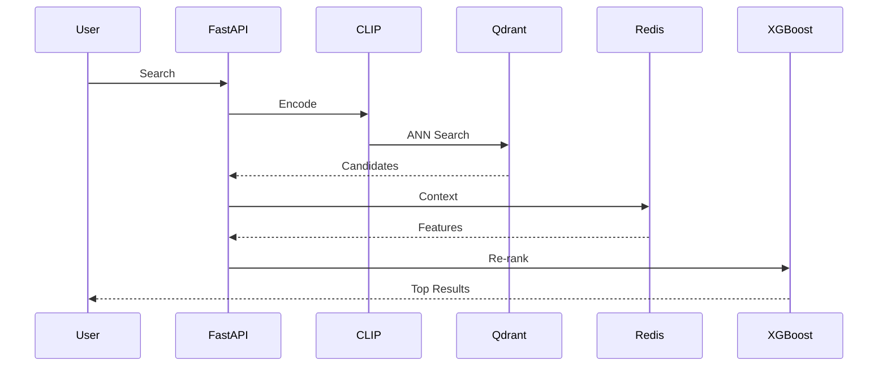
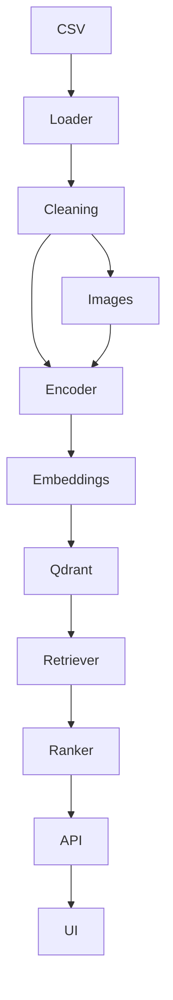

# SearchForge

[](#) [](#) [](#)
## Production-Grade Multi-Modal Visual Search & Context-Aware Re-ranking Engine
## Table of Contents
1. Overview
2. Features
3. Architecture
4. Data Flow
5. Technology Stack
6. Folder Structure
7. Installation
8. Configuration
9. Usage
10. API
11. Development Workflow
12. CI/CD
13. Testing
14. Performance
15. Deployment
16. Roadmap
17. Screenshots
18. FAQ
19. Troubleshooting
20. Contributing
21. License
22. References

# Overview
SearchForge is a production-ready semantic search platform built around CLIP, Qdrant, Redis, XGBoost, FastAPI and Next.js.

# Architecture


# Component Interaction



# Data Flow


# Technology Stack

|Component|Technology|
|---|---|
|ML|PyTorch + HuggingFace|
|Backend|FastAPI|
|Vector DB|Qdrant|
|Cache|Redis|
|Ranking|XGBoost|
|Frontend|Next.js + Tailwind CSS|
|Deployment|Docker|
# Performance Targets
- Retrieval <50ms
- API <150ms
- Recall >95%
- Uptime 99%
- Vector Dimension 512
- Index Size 10 Million
# Folder Structure
```text
SearchForge/
├── config/
│   ├── qdrant_config.json      # Qdrant collection configuration
│   └── xgboost_params.json     # Ranking model hyperparameters
│
├── data/
│   ├── processed/              # Processed datasets
│   │   └── .gitkeep
│   └── raw/
│       └── sample_products.csv # Sample product catalog
│
├── models/
│   ├── encoders/
│   │   └── .gitkeep            # CLIP checkpoints
│   └── ranker/
│       └── .gitkeep            # XGBoost models
│
├── src/
│   ├── api/
│   │   ├── main.py             # FastAPI entrypoint
│   │   └── routes.py           # Search endpoints
│   │
│   ├── core/
│   │   ├── config.py           # Global configuration
│   │   ├── embedding.py        # CLIP embedding engine
│   │   ├── image_processor.py
│   │   └── text_processor.py
│   │
│   ├── pipeline/
│   │   ├── data_loader.py
│   │   ├── build_embeddings.py
│   │   ├── ingest_vectors.py
│   │   └── train_ranker.py
│   │
│   ├── retrieval/
│   │   ├── collection_manager.py
│   │   └── search_service.py
│   │
│   └── reranking/
│       ├── feature_store.py
│       └── ranker_service.py
│
├── tests/
│   ├── test_retrieval.py
│   └── test_reranking.py
│
├── ui/
│   ├── src/
│   │   ├── app/
│   │   └── components/
│   └── package.json
│
├── docker-compose.yml
├── Dockerfile.api
├── requirements.txt
└── README.md
```
# Installation
## Docker
```bash
docker compose up --build
```
## Local
```bash
python -m venv .venv
pip install -r requirements.txt
uvicorn src.api.main:app --reload
```
## GPU
Install CUDA-enabled PyTorch before running embedding generation.
# Configuration
Environment variables include QDRANT_URL, REDIS_URL, MODEL_NAME, DEVICE, BATCH_SIZE.
# API Documentation
POST /search
POST /search/image
POST /search/hybrid
GET /health
# Development Workflow
Feature branch -> Tests -> PR -> Review -> Merge.
# CI/CD
GitHub Actions: lint, unit tests, integration tests, Docker build, security scan.
# Testing
pytest
coverage
integration tests with Docker Compose.
# Deployment
Docker Compose locally. Kubernetes planned.
# Roadmap
Phase 1 Embeddings
Phase 2 Vector Search
Phase 3 Re-ranking
Phase 4 API & UI
# Screenshots
Place images under docs/images.
# FAQ
Q: GPU required?
A: No, CPU supported.
# Troubleshooting
Check Redis, Qdrant, CUDA, environment variables.
# Contributing
Fork, branch, commit, PR.
# License
MIT
# References
FastAPI, Qdrant, PyTorch, HuggingFace, Redis, XGBoost documentation.
- Documentation note 1: SearchForge engineering guideline placeholder for future expansion.
- Documentation note 2: SearchForge engineering guideline placeholder for future expansion.
- Documentation note 3: SearchForge engineering guideline placeholder for future expansion.
- Documentation note 4: SearchForge engineering guideline placeholder for future expansion.
- Documentation note 5: SearchForge engineering guideline placeholder for future expansion.
- Documentation note 6: SearchForge engineering guideline placeholder for future expansion.
- Documentation note 7: SearchForge engineering guideline placeholder for future expansion.
- Documentation note 8: SearchForge engineering guideline placeholder for future expansion.
- Documentation note 9: SearchForge engineering guideline placeholder for future expansion.
- Documentation note 10: SearchForge engineering guideline placeholder for future expansion.
- Documentation note 11: SearchForge engineering guideline placeholder for future expansion.
- Documentation note 12: SearchForge engineering guideline placeholder for future expansion.
- Documentation note 13: SearchForge engineering guideline placeholder for future expansion.
- Documentation note 14: SearchForge engineering guideline placeholder for future expansion.
- Documentation note 15: SearchForge engineering guideline placeholder for future expansion.
- Documentation note 16: SearchForge engineering guideline placeholder for future expansion.
- Documentation note 17: SearchForge engineering guideline placeholder for future expansion.
- Documentation note 18: SearchForge engineering guideline placeholder for future expansion.
- Documentation note 19: SearchForge engineering guideline placeholder for future expansion.
- Documentation note 20: SearchForge engineering guideline placeholder for future expansion.
- Documentation note 21: SearchForge engineering guideline placeholder for future expansion.
- Documentation note 22: SearchForge engineering guideline placeholder for future expansion.
- Documentation note 23: SearchForge engineering guideline placeholder for future expansion.
- Documentation note 24: SearchForge engineering guideline placeholder for future expansion.
- Documentation note 25: SearchForge engineering guideline placeholder for future expansion.
- Documentation note 26: SearchForge engineering guideline placeholder for future expansion.
- Documentation note 27: SearchForge engineering guideline placeholder for future expansion.
- Documentation note 28: SearchForge engineering guideline placeholder for future expansion.
- Documentation note 29: SearchForge engineering guideline placeholder for future expansion.
- Documentation note 30: SearchForge engineering guideline placeholder for future expansion.
- Documentation note 31: SearchForge engineering guideline placeholder for future expansion.
- Documentation note 32: SearchForge engineering guideline placeholder for future expansion.
- Documentation note 33: SearchForge engineering guideline placeholder for future expansion.
- Documentation note 34: SearchForge engineering guideline placeholder for future expansion.
- Documentation note 35: SearchForge engineering guideline placeholder for future expansion.
- Documentation note 36: SearchForge engineering guideline placeholder for future expansion.
- Documentation note 37: SearchForge engineering guideline placeholder for future expansion.
- Documentation note 38: SearchForge engineering guideline placeholder for future expansion.
- Documentation note 39: SearchForge engineering guideline placeholder for future expansion.
- Documentation note 40: SearchForge engineering guideline placeholder for future expansion.
- Documentation note 41: SearchForge engineering guideline placeholder for future expansion.
- Documentation note 42: SearchForge engineering guideline placeholder for future expansion.
- Documentation note 43: SearchForge engineering guideline placeholder for future expansion.
- Documentation note 44: SearchForge engineering guideline placeholder for future expansion.
- Documentation note 45: SearchForge engineering guideline placeholder for future expansion.
- Documentation note 46: SearchForge engineering guideline placeholder for future expansion.
- Documentation note 47: SearchForge engineering guideline placeholder for future expansion.
- Documentation note 48: SearchForge engineering guideline placeholder for future expansion.
- Documentation note 49: SearchForge engineering guideline placeholder for future expansion.
- Documentation note 50: SearchForge engineering guideline placeholder for future expansion.
- Documentation note 51: SearchForge engineering guideline placeholder for future expansion.
- Documentation note 52: SearchForge engineering guideline placeholder for future expansion.
- Documentation note 53: SearchForge engineering guideline placeholder for future expansion.
- Documentation note 54: SearchForge engineering guideline placeholder for future expansion.
- Documentation note 55: SearchForge engineering guideline placeholder for future expansion.
- Documentation note 56: SearchForge engineering guideline placeholder for future expansion.
- Documentation note 57: SearchForge engineering guideline placeholder for future expansion.
- Documentation note 58: SearchForge engineering guideline placeholder for future expansion.
- Documentation note 59: SearchForge engineering guideline placeholder for future expansion.
- Documentation note 60: SearchForge engineering guideline placeholder for future expansion.
- Documentation note 61: SearchForge engineering guideline placeholder for future expansion.
- Documentation note 62: SearchForge engineering guideline placeholder for future expansion.
- Documentation note 63: SearchForge engineering guideline placeholder for future expansion.
- Documentation note 64: SearchForge engineering guideline placeholder for future expansion.
- Documentation note 65: SearchForge engineering guideline placeholder for future expansion.
- Documentation note 66: SearchForge engineering guideline placeholder for future expansion.
- Documentation note 67: SearchForge engineering guideline placeholder for future expansion.
- Documentation note 68: SearchForge engineering guideline placeholder for future expansion.
- Documentation note 69: SearchForge engineering guideline placeholder for future expansion.
- Documentation note 70: SearchForge engineering guideline placeholder for future expansion.
- Documentation note 71: SearchForge engineering guideline placeholder for future expansion.
- Documentation note 72: SearchForge engineering guideline placeholder for future expansion.
- Documentation note 73: SearchForge engineering guideline placeholder for future expansion.
- Documentation note 74: SearchForge engineering guideline placeholder for future expansion.
- Documentation note 75: SearchForge engineering guideline placeholder for future expansion.
- Documentation note 76: SearchForge engineering guideline placeholder for future expansion.
- Documentation note 77: SearchForge engineering guideline placeholder for future expansion.
- Documentation note 78: SearchForge engineering guideline placeholder for future expansion.
- Documentation note 79: SearchForge engineering guideline placeholder for future expansion.
- Documentation note 80: SearchForge engineering guideline placeholder for future expansion.
- Documentation note 81: SearchForge engineering guideline placeholder for future expansion.
- Documentation note 82: SearchForge engineering guideline placeholder for future expansion.
- Documentation note 83: SearchForge engineering guideline placeholder for future expansion.
- Documentation note 84: SearchForge engineering guideline placeholder for future expansion.
- Documentation note 85: SearchForge engineering guideline placeholder for future expansion.
- Documentation note 86: SearchForge engineering guideline placeholder for future expansion.
- Documentation note 87: SearchForge engineering guideline placeholder for future expansion.
- Documentation note 88: SearchForge engineering guideline placeholder for future expansion.
- Documentation note 89: SearchForge engineering guideline placeholder for future expansion.
- Documentation note 90: SearchForge engineering guideline placeholder for future expansion.
- Documentation note 91: SearchForge engineering guideline placeholder for future expansion.
- Documentation note 92: SearchForge engineering guideline placeholder for future expansion.
- Documentation note 93: SearchForge engineering guideline placeholder for future expansion.
- Documentation note 94: SearchForge engineering guideline placeholder for future expansion.
- Documentation note 95: SearchForge engineering guideline placeholder for future expansion.
- Documentation note 96: SearchForge engineering guideline placeholder for future expansion.
- Documentation note 97: SearchForge engineering guideline placeholder for future expansion.
- Documentation note 98: SearchForge engineering guideline placeholder for future expansion.
- Documentation note 99: SearchForge engineering guideline placeholder for future expansion.
- Documentation note 100: SearchForge engineering guideline placeholder for future expansion.
- Documentation note 101: SearchForge engineering guideline placeholder for future expansion.
- Documentation note 102: SearchForge engineering guideline placeholder for future expansion.
- Documentation note 103: SearchForge engineering guideline placeholder for future expansion.
- Documentation note 104: SearchForge engineering guideline placeholder for future expansion.
- Documentation note 105: SearchForge engineering guideline placeholder for future expansion.
- Documentation note 106: SearchForge engineering guideline placeholder for future expansion.
- Documentation note 107: SearchForge engineering guideline placeholder for future expansion.
- Documentation note 108: SearchForge engineering guideline placeholder for future expansion.
- Documentation note 109: SearchForge engineering guideline placeholder for future expansion.
- Documentation note 110: SearchForge engineering guideline placeholder for future expansion.
- Documentation note 111: SearchForge engineering guideline placeholder for future expansion.
- Documentation note 112: SearchForge engineering guideline placeholder for future expansion.
- Documentation note 113: SearchForge engineering guideline placeholder for future expansion.
- Documentation note 114: SearchForge engineering guideline placeholder for future expansion.
- Documentation note 115: SearchForge engineering guideline placeholder for future expansion.
- Documentation note 116: SearchForge engineering guideline placeholder for future expansion.
- Documentation note 117: SearchForge engineering guideline placeholder for future expansion.
- Documentation note 118: SearchForge engineering guideline placeholder for future expansion.
- Documentation note 119: SearchForge engineering guideline placeholder for future expansion.
- Documentation note 120: SearchForge engineering guideline placeholder for future expansion.
- Documentation note 121: SearchForge engineering guideline placeholder for future expansion.
- Documentation note 122: SearchForge engineering guideline placeholder for future expansion.
- Documentation note 123: SearchForge engineering guideline placeholder for future expansion.
- Documentation note 124: SearchForge engineering guideline placeholder for future expansion.
- Documentation note 125: SearchForge engineering guideline placeholder for future expansion.
- Documentation note 126: SearchForge engineering guideline placeholder for future expansion.
- Documentation note 127: SearchForge engineering guideline placeholder for future expansion.
- Documentation note 128: SearchForge engineering guideline placeholder for future expansion.
- Documentation note 129: SearchForge engineering guideline placeholder for future expansion.
- Documentation note 130: SearchForge engineering guideline placeholder for future expansion.
- Documentation note 131: SearchForge engineering guideline placeholder for future expansion.
- Documentation note 132: SearchForge engineering guideline placeholder for future expansion.
- Documentation note 133: SearchForge engineering guideline placeholder for future expansion.
- Documentation note 134: SearchForge engineering guideline placeholder for future expansion.
- Documentation note 135: SearchForge engineering guideline placeholder for future expansion.
- Documentation note 136: SearchForge engineering guideline placeholder for future expansion.
- Documentation note 137: SearchForge engineering guideline placeholder for future expansion.
- Documentation note 138: SearchForge engineering guideline placeholder for future expansion.
- Documentation note 139: SearchForge engineering guideline placeholder for future expansion.
- Documentation note 140: SearchForge engineering guideline placeholder for future expansion.
- Documentation note 141: SearchForge engineering guideline placeholder for future expansion.
- Documentation note 142: SearchForge engineering guideline placeholder for future expansion.
- Documentation note 143: SearchForge engineering guideline placeholder for future expansion.
- Documentation note 144: SearchForge engineering guideline placeholder for future expansion.
- Documentation note 145: SearchForge engineering guideline placeholder for future expansion.
- Documentation note 146: SearchForge engineering guideline placeholder for future expansion.
- Documentation note 147: SearchForge engineering guideline placeholder for future expansion.
- Documentation note 148: SearchForge engineering guideline placeholder for future expansion.
- Documentation note 149: SearchForge engineering guideline placeholder for future expansion.
- Documentation note 150: SearchForge engineering guideline placeholder for future expansion.
- Documentation note 151: SearchForge engineering guideline placeholder for future expansion.
- Documentation note 152: SearchForge engineering guideline placeholder for future expansion.
- Documentation note 153: SearchForge engineering guideline placeholder for future expansion.
- Documentation note 154: SearchForge engineering guideline placeholder for future expansion.
- Documentation note 155: SearchForge engineering guideline placeholder for future expansion.
- Documentation note 156: SearchForge engineering guideline placeholder for future expansion.
- Documentation note 157: SearchForge engineering guideline placeholder for future expansion.
- Documentation note 158: SearchForge engineering guideline placeholder for future expansion.
- Documentation note 159: SearchForge engineering guideline placeholder for future expansion.
- Documentation note 160: SearchForge engineering guideline placeholder for future expansion.
- Documentation note 161: SearchForge engineering guideline placeholder for future expansion.
- Documentation note 162: SearchForge engineering guideline placeholder for future expansion.
- Documentation note 163: SearchForge engineering guideline placeholder for future expansion.
- Documentation note 164: SearchForge engineering guideline placeholder for future expansion.
- Documentation note 165: SearchForge engineering guideline placeholder for future expansion.
- Documentation note 166: SearchForge engineering guideline placeholder for future expansion.
- Documentation note 167: SearchForge engineering guideline placeholder for future expansion.
- Documentation note 168: SearchForge engineering guideline placeholder for future expansion.
- Documentation note 169: SearchForge engineering guideline placeholder for future expansion.
- Documentation note 170: SearchForge engineering guideline placeholder for future expansion.
- Documentation note 171: SearchForge engineering guideline placeholder for future expansion.
- Documentation note 172: SearchForge engineering guideline placeholder for future expansion.
- Documentation note 173: SearchForge engineering guideline placeholder for future expansion.
- Documentation note 174: SearchForge engineering guideline placeholder for future expansion.
- Documentation note 175: SearchForge engineering guideline placeholder for future expansion.
- Documentation note 176: SearchForge engineering guideline placeholder for future expansion.
- Documentation note 177: SearchForge engineering guideline placeholder for future expansion.
- Documentation note 178: SearchForge engineering guideline placeholder for future expansion.
- Documentation note 179: SearchForge engineering guideline placeholder for future expansion.
- Documentation note 180: SearchForge engineering guideline placeholder for future expansion.
- Documentation note 181: SearchForge engineering guideline placeholder for future expansion.
- Documentation note 182: SearchForge engineering guideline placeholder for future expansion.
- Documentation note 183: SearchForge engineering guideline placeholder for future expansion.
- Documentation note 184: SearchForge engineering guideline placeholder for future expansion.
- Documentation note 185: SearchForge engineering guideline placeholder for future expansion.
- Documentation note 186: SearchForge engineering guideline placeholder for future expansion.
- Documentation note 187: SearchForge engineering guideline placeholder for future expansion.
- Documentation note 188: SearchForge engineering guideline placeholder for future expansion.
- Documentation note 189: SearchForge engineering guideline placeholder for future expansion.
- Documentation note 190: SearchForge engineering guideline placeholder for future expansion.
- Documentation note 191: SearchForge engineering guideline placeholder for future expansion.
- Documentation note 192: SearchForge engineering guideline placeholder for future expansion.
- Documentation note 193: SearchForge engineering guideline placeholder for future expansion.
- Documentation note 194: SearchForge engineering guideline placeholder for future expansion.
- Documentation note 195: SearchForge engineering guideline placeholder for future expansion.
- Documentation note 196: SearchForge engineering guideline placeholder for future expansion.
- Documentation note 197: SearchForge engineering guideline placeholder for future expansion.
- Documentation note 198: SearchForge engineering guideline placeholder for future expansion.
- Documentation note 199: SearchForge engineering guideline placeholder for future expansion.
- Documentation note 200: SearchForge engineering guideline placeholder for future expansion.
- Documentation note 201: SearchForge engineering guideline placeholder for future expansion.
- Documentation note 202: SearchForge engineering guideline placeholder for future expansion.
- Documentation note 203: SearchForge engineering guideline placeholder for future expansion.
- Documentation note 204: SearchForge engineering guideline placeholder for future expansion.
- Documentation note 205: SearchForge engineering guideline placeholder for future expansion.
- Documentation note 206: SearchForge engineering guideline placeholder for future expansion.
- Documentation note 207: SearchForge engineering guideline placeholder for future expansion.
- Documentation note 208: SearchForge engineering guideline placeholder for future expansion.
- Documentation note 209: SearchForge engineering guideline placeholder for future expansion.
- Documentation note 210: SearchForge engineering guideline placeholder for future expansion.
- Documentation note 211: SearchForge engineering guideline placeholder for future expansion.
- Documentation note 212: SearchForge engineering guideline placeholder for future expansion.
- Documentation note 213: SearchForge engineering guideline placeholder for future expansion.
- Documentation note 214: SearchForge engineering guideline placeholder for future expansion.
- Documentation note 215: SearchForge engineering guideline placeholder for future expansion.
- Documentation note 216: SearchForge engineering guideline placeholder for future expansion.
- Documentation note 217: SearchForge engineering guideline placeholder for future expansion.
- Documentation note 218: SearchForge engineering guideline placeholder for future expansion.
- Documentation note 219: SearchForge engineering guideline placeholder for future expansion.
- Documentation note 220: SearchForge engineering guideline placeholder for future expansion.
- Documentation note 221: SearchForge engineering guideline placeholder for future expansion.
- Documentation note 222: SearchForge engineering guideline placeholder for future expansion.
- Documentation note 223: SearchForge engineering guideline placeholder for future expansion.
- Documentation note 224: SearchForge engineering guideline placeholder for future expansion.
- Documentation note 225: SearchForge engineering guideline placeholder for future expansion.
- Documentation note 226: SearchForge engineering guideline placeholder for future expansion.
- Documentation note 227: SearchForge engineering guideline placeholder for future expansion.
- Documentation note 228: SearchForge engineering guideline placeholder for future expansion.
- Documentation note 229: SearchForge engineering guideline placeholder for future expansion.
- Documentation note 230: SearchForge engineering guideline placeholder for future expansion.
- Documentation note 231: SearchForge engineering guideline placeholder for future expansion.
- Documentation note 232: SearchForge engineering guideline placeholder for future expansion.
- Documentation note 233: SearchForge engineering guideline placeholder for future expansion.
- Documentation note 234: SearchForge engineering guideline placeholder for future expansion.
- Documentation note 235: SearchForge engineering guideline placeholder for future expansion.
- Documentation note 236: SearchForge engineering guideline placeholder for future expansion.
- Documentation note 237: SearchForge engineering guideline placeholder for future expansion.
- Documentation note 238: SearchForge engineering guideline placeholder for future expansion.
- Documentation note 239: SearchForge engineering guideline placeholder for future expansion.
- Documentation note 240: SearchForge engineering guideline placeholder for future expansion.
- Documentation note 241: SearchForge engineering guideline placeholder for future expansion.
- Documentation note 242: SearchForge engineering guideline placeholder for future expansion.
- Documentation note 243: SearchForge engineering guideline placeholder for future expansion.
- Documentation note 244: SearchForge engineering guideline placeholder for future expansion.
- Documentation note 245: SearchForge engineering guideline placeholder for future expansion.
- Documentation note 246: SearchForge engineering guideline placeholder for future expansion.
- Documentation note 247: SearchForge engineering guideline placeholder for future expansion.
- Documentation note 248: SearchForge engineering guideline placeholder for future expansion.
- Documentation note 249: SearchForge engineering guideline placeholder for future expansion.
- Documentation note 250: SearchForge engineering guideline placeholder for future expansion.
- Documentation note 251: SearchForge engineering guideline placeholder for future expansion.
- Documentation note 252: SearchForge engineering guideline placeholder for future expansion.
- Documentation note 253: SearchForge engineering guideline placeholder for future expansion.
- Documentation note 254: SearchForge engineering guideline placeholder for future expansion.
- Documentation note 255: SearchForge engineering guideline placeholder for future expansion.
- Documentation note 256: SearchForge engineering guideline placeholder for future expansion.
- Documentation note 257: SearchForge engineering guideline placeholder for future expansion.
- Documentation note 258: SearchForge engineering guideline placeholder for future expansion.
- Documentation note 259: SearchForge engineering guideline placeholder for future expansion.
- Documentation note 260: SearchForge engineering guideline placeholder for future expansion.
- Documentation note 261: SearchForge engineering guideline placeholder for future expansion.
- Documentation note 262: SearchForge engineering guideline placeholder for future expansion.
- Documentation note 263: SearchForge engineering guideline placeholder for future expansion.
- Documentation note 264: SearchForge engineering guideline placeholder for future expansion.
- Documentation note 265: SearchForge engineering guideline placeholder for future expansion.
- Documentation note 266: SearchForge engineering guideline placeholder for future expansion.
- Documentation note 267: SearchForge engineering guideline placeholder for future expansion.
- Documentation note 268: SearchForge engineering guideline placeholder for future expansion.
- Documentation note 269: SearchForge engineering guideline placeholder for future expansion.
- Documentation note 270: SearchForge engineering guideline placeholder for future expansion.
- Documentation note 271: SearchForge engineering guideline placeholder for future expansion.
- Documentation note 272: SearchForge engineering guideline placeholder for future expansion.
- Documentation note 273: SearchForge engineering guideline placeholder for future expansion.
- Documentation note 274: SearchForge engineering guideline placeholder for future expansion.
- Documentation note 275: SearchForge engineering guideline placeholder for future expansion.
- Documentation note 276: SearchForge engineering guideline placeholder for future expansion.
- Documentation note 277: SearchForge engineering guideline placeholder for future expansion.
- Documentation note 278: SearchForge engineering guideline placeholder for future expansion.
- Documentation note 279: SearchForge engineering guideline placeholder for future expansion.
- Documentation note 280: SearchForge engineering guideline placeholder for future expansion.
- Documentation note 281: SearchForge engineering guideline placeholder for future expansion.
- Documentation note 282: SearchForge engineering guideline placeholder for future expansion.
- Documentation note 283: SearchForge engineering guideline placeholder for future expansion.
- Documentation note 284: SearchForge engineering guideline placeholder for future expansion.
- Documentation note 285: SearchForge engineering guideline placeholder for future expansion.
- Documentation note 286: SearchForge engineering guideline placeholder for future expansion.
- Documentation note 287: SearchForge engineering guideline placeholder for future expansion.
- Documentation note 288: SearchForge engineering guideline placeholder for future expansion.
- Documentation note 289: SearchForge engineering guideline placeholder for future expansion.
- Documentation note 290: SearchForge engineering guideline placeholder for future expansion.
- Documentation note 291: SearchForge engineering guideline placeholder for future expansion.
- Documentation note 292: SearchForge engineering guideline placeholder for future expansion.
- Documentation note 293: SearchForge engineering guideline placeholder for future expansion.
- Documentation note 294: SearchForge engineering guideline placeholder for future expansion.
- Documentation note 295: SearchForge engineering guideline placeholder for future expansion.
- Documentation note 296: SearchForge engineering guideline placeholder for future expansion.
- Documentation note 297: SearchForge engineering guideline placeholder for future expansion.
- Documentation note 298: SearchForge engineering guideline placeholder for future expansion.
- Documentation note 299: SearchForge engineering guideline placeholder for future expansion.
- Documentation note 300: SearchForge engineering guideline placeholder for future expansion.
- Documentation note 301: SearchForge engineering guideline placeholder for future expansion.
- Documentation note 302: SearchForge engineering guideline placeholder for future expansion.
- Documentation note 303: SearchForge engineering guideline placeholder for future expansion.
- Documentation note 304: SearchForge engineering guideline placeholder for future expansion.
- Documentation note 305: SearchForge engineering guideline placeholder for future expansion.
- Documentation note 306: SearchForge engineering guideline placeholder for future expansion.
- Documentation note 307: SearchForge engineering guideline placeholder for future expansion.
- Documentation note 308: SearchForge engineering guideline placeholder for future expansion.
- Documentation note 309: SearchForge engineering guideline placeholder for future expansion.
- Documentation note 310: SearchForge engineering guideline placeholder for future expansion.
- Documentation note 311: SearchForge engineering guideline placeholder for future expansion.
- Documentation note 312: SearchForge engineering guideline placeholder for future expansion.
- Documentation note 313: SearchForge engineering guideline placeholder for future expansion.
- Documentation note 314: SearchForge engineering guideline placeholder for future expansion.
- Documentation note 315: SearchForge engineering guideline placeholder for future expansion.
- Documentation note 316: SearchForge engineering guideline placeholder for future expansion.
- Documentation note 317: SearchForge engineering guideline placeholder for future expansion.
- Documentation note 318: SearchForge engineering guideline placeholder for future expansion.
- Documentation note 319: SearchForge engineering guideline placeholder for future expansion.
- Documentation note 320: SearchForge engineering guideline placeholder for future expansion.
- Documentation note 321: SearchForge engineering guideline placeholder for future expansion.
- Documentation note 322: SearchForge engineering guideline placeholder for future expansion.
- Documentation note 323: SearchForge engineering guideline placeholder for future expansion.
- Documentation note 324: SearchForge engineering guideline placeholder for future expansion.
- Documentation note 325: SearchForge engineering guideline placeholder for future expansion.
- Documentation note 326: SearchForge engineering guideline placeholder for future expansion.
- Documentation note 327: SearchForge engineering guideline placeholder for future expansion.
- Documentation note 328: SearchForge engineering guideline placeholder for future expansion.
- Documentation note 329: SearchForge engineering guideline placeholder for future expansion.
- Documentation note 330: SearchForge engineering guideline placeholder for future expansion.
- Documentation note 331: SearchForge engineering guideline placeholder for future expansion.
- Documentation note 332: SearchForge engineering guideline placeholder for future expansion.
- Documentation note 333: SearchForge engineering guideline placeholder for future expansion.
- Documentation note 334: SearchForge engineering guideline placeholder for future expansion.
- Documentation note 335: SearchForge engineering guideline placeholder for future expansion.
- Documentation note 336: SearchForge engineering guideline placeholder for future expansion.
- Documentation note 337: SearchForge engineering guideline placeholder for future expansion.
- Documentation note 338: SearchForge engineering guideline placeholder for future expansion.
- Documentation note 339: SearchForge engineering guideline placeholder for future expansion.
- Documentation note 340: SearchForge engineering guideline placeholder for future expansion.
- Documentation note 341: SearchForge engineering guideline placeholder for future expansion.
- Documentation note 342: SearchForge engineering guideline placeholder for future expansion.
- Documentation note 343: SearchForge engineering guideline placeholder for future expansion.
- Documentation note 344: SearchForge engineering guideline placeholder for future expansion.
- Documentation note 345: SearchForge engineering guideline placeholder for future expansion.
- Documentation note 346: SearchForge engineering guideline placeholder for future expansion.
- Documentation note 347: SearchForge engineering guideline placeholder for future expansion.
- Documentation note 348: SearchForge engineering guideline placeholder for future expansion.
- Documentation note 349: SearchForge engineering guideline placeholder for future expansion.
- Documentation note 350: SearchForge engineering guideline placeholder for future expansion.
- Documentation note 351: SearchForge engineering guideline placeholder for future expansion.
- Documentation note 352: SearchForge engineering guideline placeholder for future expansion.
- Documentation note 353: SearchForge engineering guideline placeholder for future expansion.
- Documentation note 354: SearchForge engineering guideline placeholder for future expansion.
- Documentation note 355: SearchForge engineering guideline placeholder for future expansion.
- Documentation note 356: SearchForge engineering guideline placeholder for future expansion.
- Documentation note 357: SearchForge engineering guideline placeholder for future expansion.
- Documentation note 358: SearchForge engineering guideline placeholder for future expansion.
- Documentation note 359: SearchForge engineering guideline placeholder for future expansion.
- Documentation note 360: SearchForge engineering guideline placeholder for future expansion.
- Documentation note 361: SearchForge engineering guideline placeholder for future expansion.
- Documentation note 362: SearchForge engineering guideline placeholder for future expansion.
- Documentation note 363: SearchForge engineering guideline placeholder for future expansion.
- Documentation note 364: SearchForge engineering guideline placeholder for future expansion.
- Documentation note 365: SearchForge engineering guideline placeholder for future expansion.
- Documentation note 366: SearchForge engineering guideline placeholder for future expansion.
- Documentation note 367: SearchForge engineering guideline placeholder for future expansion.
- Documentation note 368: SearchForge engineering guideline placeholder for future expansion.
- Documentation note 369: SearchForge engineering guideline placeholder for future expansion.
- Documentation note 370: SearchForge engineering guideline placeholder for future expansion.
- Documentation note 371: SearchForge engineering guideline placeholder for future expansion.
- Documentation note 372: SearchForge engineering guideline placeholder for future expansion.
- Documentation note 373: SearchForge engineering guideline placeholder for future expansion.
- Documentation note 374: SearchForge engineering guideline placeholder for future expansion.
- Documentation note 375: SearchForge engineering guideline placeholder for future expansion.
- Documentation note 376: SearchForge engineering guideline placeholder for future expansion.
- Documentation note 377: SearchForge engineering guideline placeholder for future expansion.
- Documentation note 378: SearchForge engineering guideline placeholder for future expansion.
- Documentation note 379: SearchForge engineering guideline placeholder for future expansion.
- Documentation note 380: SearchForge engineering guideline placeholder for future expansion.
- Documentation note 381: SearchForge engineering guideline placeholder for future expansion.
- Documentation note 382: SearchForge engineering guideline placeholder for future expansion.
- Documentation note 383: SearchForge engineering guideline placeholder for future expansion.
- Documentation note 384: SearchForge engineering guideline placeholder for future expansion.
- Documentation note 385: SearchForge engineering guideline placeholder for future expansion.
- Documentation note 386: SearchForge engineering guideline placeholder for future expansion.
- Documentation note 387: SearchForge engineering guideline placeholder for future expansion.
- Documentation note 388: SearchForge engineering guideline placeholder for future expansion.
- Documentation note 389: SearchForge engineering guideline placeholder for future expansion.
- Documentation note 390: SearchForge engineering guideline placeholder for future expansion.
- Documentation note 391: SearchForge engineering guideline placeholder for future expansion.
- Documentation note 392: SearchForge engineering guideline placeholder for future expansion.
- Documentation note 393: SearchForge engineering guideline placeholder for future expansion.
- Documentation note 394: SearchForge engineering guideline placeholder for future expansion.
- Documentation note 395: SearchForge engineering guideline placeholder for future expansion.
- Documentation note 396: SearchForge engineering guideline placeholder for future expansion.
- Documentation note 397: SearchForge engineering guideline placeholder for future expansion.
- Documentation note 398: SearchForge engineering guideline placeholder for future expansion.
- Documentation note 399: SearchForge engineering guideline placeholder for future expansion.
- Documentation note 400: SearchForge engineering guideline placeholder for future expansion.
- Documentation note 401: SearchForge engineering guideline placeholder for future expansion.
- Documentation note 402: SearchForge engineering guideline placeholder for future expansion.
- Documentation note 403: SearchForge engineering guideline placeholder for future expansion.
- Documentation note 404: SearchForge engineering guideline placeholder for future expansion.
- Documentation note 405: SearchForge engineering guideline placeholder for future expansion.
- Documentation note 406: SearchForge engineering guideline placeholder for future expansion.
- Documentation note 407: SearchForge engineering guideline placeholder for future expansion.
- Documentation note 408: SearchForge engineering guideline placeholder for future expansion.
- Documentation note 409: SearchForge engineering guideline placeholder for future expansion.
- Documentation note 410: SearchForge engineering guideline placeholder for future expansion.
- Documentation note 411: SearchForge engineering guideline placeholder for future expansion.
- Documentation note 412: SearchForge engineering guideline placeholder for future expansion.
- Documentation note 413: SearchForge engineering guideline placeholder for future expansion.
- Documentation note 414: SearchForge engineering guideline placeholder for future expansion.
- Documentation note 415: SearchForge engineering guideline placeholder for future expansion.
- Documentation note 416: SearchForge engineering guideline placeholder for future expansion.
- Documentation note 417: SearchForge engineering guideline placeholder for future expansion.
- Documentation note 418: SearchForge engineering guideline placeholder for future expansion.
- Documentation note 419: SearchForge engineering guideline placeholder for future expansion.
- Documentation note 420: SearchForge engineering guideline placeholder for future expansion.
- Documentation note 421: SearchForge engineering guideline placeholder for future expansion.
- Documentation note 422: SearchForge engineering guideline placeholder for future expansion.
- Documentation note 423: SearchForge engineering guideline placeholder for future expansion.
- Documentation note 424: SearchForge engineering guideline placeholder for future expansion.
- Documentation note 425: SearchForge engineering guideline placeholder for future expansion.
- Documentation note 426: SearchForge engineering guideline placeholder for future expansion.
- Documentation note 427: SearchForge engineering guideline placeholder for future expansion.
- Documentation note 428: SearchForge engineering guideline placeholder for future expansion.
- Documentation note 429: SearchForge engineering guideline placeholder for future expansion.
- Documentation note 430: SearchForge engineering guideline placeholder for future expansion.
- Documentation note 431: SearchForge engineering guideline placeholder for future expansion.
- Documentation note 432: SearchForge engineering guideline placeholder for future expansion.
- Documentation note 433: SearchForge engineering guideline placeholder for future expansion.
- Documentation note 434: SearchForge engineering guideline placeholder for future expansion.
- Documentation note 435: SearchForge engineering guideline placeholder for future expansion.
- Documentation note 436: SearchForge engineering guideline placeholder for future expansion.
- Documentation note 437: SearchForge engineering guideline placeholder for future expansion.
- Documentation note 438: SearchForge engineering guideline placeholder for future expansion.
- Documentation note 439: SearchForge engineering guideline placeholder for future expansion.
- Documentation note 440: SearchForge engineering guideline placeholder for future expansion.
- Documentation note 441: SearchForge engineering guideline placeholder for future expansion.
- Documentation note 442: SearchForge engineering guideline placeholder for future expansion.
- Documentation note 443: SearchForge engineering guideline placeholder for future expansion.
- Documentation note 444: SearchForge engineering guideline placeholder for future expansion.
- Documentation note 445: SearchForge engineering guideline placeholder for future expansion.
- Documentation note 446: SearchForge engineering guideline placeholder for future expansion.
- Documentation note 447: SearchForge engineering guideline placeholder for future expansion.
- Documentation note 448: SearchForge engineering guideline placeholder for future expansion.
- Documentation note 449: SearchForge engineering guideline placeholder for future expansion.
- Documentation note 450: SearchForge engineering guideline placeholder for future expansion.
- Documentation note 451: SearchForge engineering guideline placeholder for future expansion.
- Documentation note 452: SearchForge engineering guideline placeholder for future expansion.
- Documentation note 453: SearchForge engineering guideline placeholder for future expansion.
- Documentation note 454: SearchForge engineering guideline placeholder for future expansion.
- Documentation note 455: SearchForge engineering guideline placeholder for future expansion.
- Documentation note 456: SearchForge engineering guideline placeholder for future expansion.
- Documentation note 457: SearchForge engineering guideline placeholder for future expansion.
- Documentation note 458: SearchForge engineering guideline placeholder for future expansion.
- Documentation note 459: SearchForge engineering guideline placeholder for future expansion.
- Documentation note 460: SearchForge engineering guideline placeholder for future expansion.
- Documentation note 461: SearchForge engineering guideline placeholder for future expansion.
- Documentation note 462: SearchForge engineering guideline placeholder for future expansion.
- Documentation note 463: SearchForge engineering guideline placeholder for future expansion.
- Documentation note 464: SearchForge engineering guideline placeholder for future expansion.
- Documentation note 465: SearchForge engineering guideline placeholder for future expansion.
- Documentation note 466: SearchForge engineering guideline placeholder for future expansion.
- Documentation note 467: SearchForge engineering guideline placeholder for future expansion.
- Documentation note 468: SearchForge engineering guideline placeholder for future expansion.
- Documentation note 469: SearchForge engineering guideline placeholder for future expansion.
- Documentation note 470: SearchForge engineering guideline placeholder for future expansion.
- Documentation note 471: SearchForge engineering guideline placeholder for future expansion.
- Documentation note 472: SearchForge engineering guideline placeholder for future expansion.
- Documentation note 473: SearchForge engineering guideline placeholder for future expansion.
- Documentation note 474: SearchForge engineering guideline placeholder for future expansion.
- Documentation note 475: SearchForge engineering guideline placeholder for future expansion.
- Documentation note 476: SearchForge engineering guideline placeholder for future expansion.
- Documentation note 477: SearchForge engineering guideline placeholder for future expansion.
- Documentation note 478: SearchForge engineering guideline placeholder for future expansion.
- Documentation note 479: SearchForge engineering guideline placeholder for future expansion.
- Documentation note 480: SearchForge engineering guideline placeholder for future expansion.
- Documentation note 481: SearchForge engineering guideline placeholder for future expansion.
- Documentation note 482: SearchForge engineering guideline placeholder for future expansion.
- Documentation note 483: SearchForge engineering guideline placeholder for future expansion.
- Documentation note 484: SearchForge engineering guideline placeholder for future expansion.
- Documentation note 485: SearchForge engineering guideline placeholder for future expansion.
- Documentation note 486: SearchForge engineering guideline placeholder for future expansion.
- Documentation note 487: SearchForge engineering guideline placeholder for future expansion.
- Documentation note 488: SearchForge engineering guideline placeholder for future expansion.
- Documentation note 489: SearchForge engineering guideline placeholder for future expansion.
- Documentation note 490: SearchForge engineering guideline placeholder for future expansion.
- Documentation note 491: SearchForge engineering guideline placeholder for future expansion.
- Documentation note 492: SearchForge engineering guideline placeholder for future expansion.
- Documentation note 493: SearchForge engineering guideline placeholder for future expansion.
- Documentation note 494: SearchForge engineering guideline placeholder for future expansion.
- Documentation note 495: SearchForge engineering guideline placeholder for future expansion.
- Documentation note 496: SearchForge engineering guideline placeholder for future expansion.
- Documentation note 497: SearchForge engineering guideline placeholder for future expansion.
- Documentation note 498: SearchForge engineering guideline placeholder for future expansion.
- Documentation note 499: SearchForge engineering guideline placeholder for future expansion.
- Documentation note 500: SearchForge engineering guideline placeholder for future expansion.
- Documentation note 501: SearchForge engineering guideline placeholder for future expansion.
- Documentation note 502: SearchForge engineering guideline placeholder for future expansion.
- Documentation note 503: SearchForge engineering guideline placeholder for future expansion.
- Documentation note 504: SearchForge engineering guideline placeholder for future expansion.
- Documentation note 505: SearchForge engineering guideline placeholder for future expansion.
- Documentation note 506: SearchForge engineering guideline placeholder for future expansion.
- Documentation note 507: SearchForge engineering guideline placeholder for future expansion.
- Documentation note 508: SearchForge engineering guideline placeholder for future expansion.
- Documentation note 509: SearchForge engineering guideline placeholder for future expansion.
- Documentation note 510: SearchForge engineering guideline placeholder for future expansion.
- Documentation note 511: SearchForge engineering guideline placeholder for future expansion.
- Documentation note 512: SearchForge engineering guideline placeholder for future expansion.
- Documentation note 513: SearchForge engineering guideline placeholder for future expansion.
- Documentation note 514: SearchForge engineering guideline placeholder for future expansion.
- Documentation note 515: SearchForge engineering guideline placeholder for future expansion.
- Documentation note 516: SearchForge engineering guideline placeholder for future expansion.
- Documentation note 517: SearchForge engineering guideline placeholder for future expansion.
- Documentation note 518: SearchForge engineering guideline placeholder for future expansion.
- Documentation note 519: SearchForge engineering guideline placeholder for future expansion.
- Documentation note 520: SearchForge engineering guideline placeholder for future expansion.
- Documentation note 521: SearchForge engineering guideline placeholder for future expansion.
- Documentation note 522: SearchForge engineering guideline placeholder for future expansion.
- Documentation note 523: SearchForge engineering guideline placeholder for future expansion.
- Documentation note 524: SearchForge engineering guideline placeholder for future expansion.
- Documentation note 525: SearchForge engineering guideline placeholder for future expansion.
- Documentation note 526: SearchForge engineering guideline placeholder for future expansion.
- Documentation note 527: SearchForge engineering guideline placeholder for future expansion.
- Documentation note 528: SearchForge engineering guideline placeholder for future expansion.
- Documentation note 529: SearchForge engineering guideline placeholder for future expansion.
- Documentation note 530: SearchForge engineering guideline placeholder for future expansion.
- Documentation note 531: SearchForge engineering guideline placeholder for future expansion.
- Documentation note 532: SearchForge engineering guideline placeholder for future expansion.
- Documentation note 533: SearchForge engineering guideline placeholder for future expansion.
- Documentation note 534: SearchForge engineering guideline placeholder for future expansion.
- Documentation note 535: SearchForge engineering guideline placeholder for future expansion.
- Documentation note 536: SearchForge engineering guideline placeholder for future expansion.
- Documentation note 537: SearchForge engineering guideline placeholder for future expansion.
- Documentation note 538: SearchForge engineering guideline placeholder for future expansion.
- Documentation note 539: SearchForge engineering guideline placeholder for future expansion.
- Documentation note 540: SearchForge engineering guideline placeholder for future expansion.
- Documentation note 541: SearchForge engineering guideline placeholder for future expansion.
- Documentation note 542: SearchForge engineering guideline placeholder for future expansion.
- Documentation note 543: SearchForge engineering guideline placeholder for future expansion.
- Documentation note 544: SearchForge engineering guideline placeholder for future expansion.
- Documentation note 545: SearchForge engineering guideline placeholder for future expansion.
- Documentation note 546: SearchForge engineering guideline placeholder for future expansion.
- Documentation note 547: SearchForge engineering guideline placeholder for future expansion.
- Documentation note 548: SearchForge engineering guideline placeholder for future expansion.
- Documentation note 549: SearchForge engineering guideline placeholder for future expansion.
- Documentation note 550: SearchForge engineering guideline placeholder for future expansion.
- Documentation note 551: SearchForge engineering guideline placeholder for future expansion.
- Documentation note 552: SearchForge engineering guideline placeholder for future expansion.
- Documentation note 553: SearchForge engineering guideline placeholder for future expansion.
- Documentation note 554: SearchForge engineering guideline placeholder for future expansion.
- Documentation note 555: SearchForge engineering guideline placeholder for future expansion.
- Documentation note 556: SearchForge engineering guideline placeholder for future expansion.
- Documentation note 557: SearchForge engineering guideline placeholder for future expansion.
- Documentation note 558: SearchForge engineering guideline placeholder for future expansion.
- Documentation note 559: SearchForge engineering guideline placeholder for future expansion.
- Documentation note 560: SearchForge engineering guideline placeholder for future expansion.
- Documentation note 561: SearchForge engineering guideline placeholder for future expansion.
- Documentation note 562: SearchForge engineering guideline placeholder for future expansion.
- Documentation note 563: SearchForge engineering guideline placeholder for future expansion.
- Documentation note 564: SearchForge engineering guideline placeholder for future expansion.
- Documentation note 565: SearchForge engineering guideline placeholder for future expansion.
- Documentation note 566: SearchForge engineering guideline placeholder for future expansion.
- Documentation note 567: SearchForge engineering guideline placeholder for future expansion.
- Documentation note 568: SearchForge engineering guideline placeholder for future expansion.
- Documentation note 569: SearchForge engineering guideline placeholder for future expansion.
- Documentation note 570: SearchForge engineering guideline placeholder for future expansion.
- Documentation note 571: SearchForge engineering guideline placeholder for future expansion.
- Documentation note 572: SearchForge engineering guideline placeholder for future expansion.
- Documentation note 573: SearchForge engineering guideline placeholder for future expansion.
- Documentation note 574: SearchForge engineering guideline placeholder for future expansion.
- Documentation note 575: SearchForge engineering guideline placeholder for future expansion.
- Documentation note 576: SearchForge engineering guideline placeholder for future expansion.
- Documentation note 577: SearchForge engineering guideline placeholder for future expansion.
- Documentation note 578: SearchForge engineering guideline placeholder for future expansion.
- Documentation note 579: SearchForge engineering guideline placeholder for future expansion.
- Documentation note 580: SearchForge engineering guideline placeholder for future expansion.
- Documentation note 581: SearchForge engineering guideline placeholder for future expansion.
- Documentation note 582: SearchForge engineering guideline placeholder for future expansion.
- Documentation note 583: SearchForge engineering guideline placeholder for future expansion.
- Documentation note 584: SearchForge engineering guideline placeholder for future expansion.
- Documentation note 585: SearchForge engineering guideline placeholder for future expansion.
- Documentation note 586: SearchForge engineering guideline placeholder for future expansion.
- Documentation note 587: SearchForge engineering guideline placeholder for future expansion.
- Documentation note 588: SearchForge engineering guideline placeholder for future expansion.
- Documentation note 589: SearchForge engineering guideline placeholder for future expansion.
- Documentation note 590: SearchForge engineering guideline placeholder for future expansion.
- Documentation note 591: SearchForge engineering guideline placeholder for future expansion.
- Documentation note 592: SearchForge engineering guideline placeholder for future expansion.
- Documentation note 593: SearchForge engineering guideline placeholder for future expansion.
- Documentation note 594: SearchForge engineering guideline placeholder for future expansion.
- Documentation note 595: SearchForge engineering guideline placeholder for future expansion.
- Documentation note 596: SearchForge engineering guideline placeholder for future expansion.
- Documentation note 597: SearchForge engineering guideline placeholder for future expansion.
- Documentation note 598: SearchForge engineering guideline placeholder for future expansion.
- Documentation note 599: SearchForge engineering guideline placeholder for future expansion.
- Documentation note 600: SearchForge engineering guideline placeholder for future expansion.
- Documentation note 601: SearchForge engineering guideline placeholder for future expansion.
- Documentation note 602: SearchForge engineering guideline placeholder for future expansion.
- Documentation note 603: SearchForge engineering guideline placeholder for future expansion.
- Documentation note 604: SearchForge engineering guideline placeholder for future expansion.
- Documentation note 605: SearchForge engineering guideline placeholder for future expansion.
- Documentation note 606: SearchForge engineering guideline placeholder for future expansion.
- Documentation note 607: SearchForge engineering guideline placeholder for future expansion.
- Documentation note 608: SearchForge engineering guideline placeholder for future expansion.
- Documentation note 609: SearchForge engineering guideline placeholder for future expansion.
- Documentation note 610: SearchForge engineering guideline placeholder for future expansion.
- Documentation note 611: SearchForge engineering guideline placeholder for future expansion.
- Documentation note 612: SearchForge engineering guideline placeholder for future expansion.
- Documentation note 613: SearchForge engineering guideline placeholder for future expansion.
- Documentation note 614: SearchForge engineering guideline placeholder for future expansion.
- Documentation note 615: SearchForge engineering guideline placeholder for future expansion.
- Documentation note 616: SearchForge engineering guideline placeholder for future expansion.
- Documentation note 617: SearchForge engineering guideline placeholder for future expansion.
- Documentation note 618: SearchForge engineering guideline placeholder for future expansion.
- Documentation note 619: SearchForge engineering guideline placeholder for future expansion.
- Documentation note 620: SearchForge engineering guideline placeholder for future expansion.
- Documentation note 621: SearchForge engineering guideline placeholder for future expansion.
- Documentation note 622: SearchForge engineering guideline placeholder for future expansion.
- Documentation note 623: SearchForge engineering guideline placeholder for future expansion.
- Documentation note 624: SearchForge engineering guideline placeholder for future expansion.
- Documentation note 625: SearchForge engineering guideline placeholder for future expansion.
- Documentation note 626: SearchForge engineering guideline placeholder for future expansion.
- Documentation note 627: SearchForge engineering guideline placeholder for future expansion.
- Documentation note 628: SearchForge engineering guideline placeholder for future expansion.
- Documentation note 629: SearchForge engineering guideline placeholder for future expansion.
- Documentation note 630: SearchForge engineering guideline placeholder for future expansion.
- Documentation note 631: SearchForge engineering guideline placeholder for future expansion.
- Documentation note 632: SearchForge engineering guideline placeholder for future expansion.
- Documentation note 633: SearchForge engineering guideline placeholder for future expansion.
- Documentation note 634: SearchForge engineering guideline placeholder for future expansion.
- Documentation note 635: SearchForge engineering guideline placeholder for future expansion.
- Documentation note 636: SearchForge engineering guideline placeholder for future expansion.
- Documentation note 637: SearchForge engineering guideline placeholder for future expansion.
- Documentation note 638: SearchForge engineering guideline placeholder for future expansion.
- Documentation note 639: SearchForge engineering guideline placeholder for future expansion.
- Documentation note 640: SearchForge engineering guideline placeholder for future expansion.
- Documentation note 641: SearchForge engineering guideline placeholder for future expansion.
- Documentation note 642: SearchForge engineering guideline placeholder for future expansion.
- Documentation note 643: SearchForge engineering guideline placeholder for future expansion.
- Documentation note 644: SearchForge engineering guideline placeholder for future expansion.
- Documentation note 645: SearchForge engineering guideline placeholder for future expansion.
- Documentation note 646: SearchForge engineering guideline placeholder for future expansion.
- Documentation note 647: SearchForge engineering guideline placeholder for future expansion.
- Documentation note 648: SearchForge engineering guideline placeholder for future expansion.
- Documentation note 649: SearchForge engineering guideline placeholder for future expansion.
- Documentation note 650: SearchForge engineering guideline placeholder for future expansion.
- Documentation note 651: SearchForge engineering guideline placeholder for future expansion.
- Documentation note 652: SearchForge engineering guideline placeholder for future expansion.
- Documentation note 653: SearchForge engineering guideline placeholder for future expansion.
- Documentation note 654: SearchForge engineering guideline placeholder for future expansion.
- Documentation note 655: SearchForge engineering guideline placeholder for future expansion.
- Documentation note 656: SearchForge engineering guideline placeholder for future expansion.
- Documentation note 657: SearchForge engineering guideline placeholder for future expansion.
- Documentation note 658: SearchForge engineering guideline placeholder for future expansion.
- Documentation note 659: SearchForge engineering guideline placeholder for future expansion.
- Documentation note 660: SearchForge engineering guideline placeholder for future expansion.
- Documentation note 661: SearchForge engineering guideline placeholder for future expansion.
- Documentation note 662: SearchForge engineering guideline placeholder for future expansion.
- Documentation note 663: SearchForge engineering guideline placeholder for future expansion.
- Documentation note 664: SearchForge engineering guideline placeholder for future expansion.
- Documentation note 665: SearchForge engineering guideline placeholder for future expansion.
- Documentation note 666: SearchForge engineering guideline placeholder for future expansion.
- Documentation note 667: SearchForge engineering guideline placeholder for future expansion.
- Documentation note 668: SearchForge engineering guideline placeholder for future expansion.
- Documentation note 669: SearchForge engineering guideline placeholder for future expansion.
- Documentation note 670: SearchForge engineering guideline placeholder for future expansion.
- Documentation note 671: SearchForge engineering guideline placeholder for future expansion.
- Documentation note 672: SearchForge engineering guideline placeholder for future expansion.
- Documentation note 673: SearchForge engineering guideline placeholder for future expansion.
- Documentation note 674: SearchForge engineering guideline placeholder for future expansion.
- Documentation note 675: SearchForge engineering guideline placeholder for future expansion.
- Documentation note 676: SearchForge engineering guideline placeholder for future expansion.
- Documentation note 677: SearchForge engineering guideline placeholder for future expansion.
- Documentation note 678: SearchForge engineering guideline placeholder for future expansion.
- Documentation note 679: SearchForge engineering guideline placeholder for future expansion.
- Documentation note 680: SearchForge engineering guideline placeholder for future expansion.
- Documentation note 681: SearchForge engineering guideline placeholder for future expansion.
- Documentation note 682: SearchForge engineering guideline placeholder for future expansion.
- Documentation note 683: SearchForge engineering guideline placeholder for future expansion.
- Documentation note 684: SearchForge engineering guideline placeholder for future expansion.
- Documentation note 685: SearchForge engineering guideline placeholder for future expansion.
- Documentation note 686: SearchForge engineering guideline placeholder for future expansion.
- Documentation note 687: SearchForge engineering guideline placeholder for future expansion.
- Documentation note 688: SearchForge engineering guideline placeholder for future expansion.
- Documentation note 689: SearchForge engineering guideline placeholder for future expansion.
- Documentation note 690: SearchForge engineering guideline placeholder for future expansion.
- Documentation note 691: SearchForge engineering guideline placeholder for future expansion.
- Documentation note 692: SearchForge engineering guideline placeholder for future expansion.
- Documentation note 693: SearchForge engineering guideline placeholder for future expansion.
- Documentation note 694: SearchForge engineering guideline placeholder for future expansion.
- Documentation note 695: SearchForge engineering guideline placeholder for future expansion.
- Documentation note 696: SearchForge engineering guideline placeholder for future expansion.
- Documentation note 697: SearchForge engineering guideline placeholder for future expansion.
- Documentation note 698: SearchForge engineering guideline placeholder for future expansion.
- Documentation note 699: SearchForge engineering guideline placeholder for future expansion.
- Documentation note 700: SearchForge engineering guideline placeholder for future expansion.
- Documentation note 701: SearchForge engineering guideline placeholder for future expansion.
- Documentation note 702: SearchForge engineering guideline placeholder for future expansion.
- Documentation note 703: SearchForge engineering guideline placeholder for future expansion.
- Documentation note 704: SearchForge engineering guideline placeholder for future expansion.
- Documentation note 705: SearchForge engineering guideline placeholder for future expansion.
- Documentation note 706: SearchForge engineering guideline placeholder for future expansion.
- Documentation note 707: SearchForge engineering guideline placeholder for future expansion.
- Documentation note 708: SearchForge engineering guideline placeholder for future expansion.
- Documentation note 709: SearchForge engineering guideline placeholder for future expansion.
- Documentation note 710: SearchForge engineering guideline placeholder for future expansion.
- Documentation note 711: SearchForge engineering guideline placeholder for future expansion.
- Documentation note 712: SearchForge engineering guideline placeholder for future expansion.
- Documentation note 713: SearchForge engineering guideline placeholder for future expansion.
- Documentation note 714: SearchForge engineering guideline placeholder for future expansion.
- Documentation note 715: SearchForge engineering guideline placeholder for future expansion.
- Documentation note 716: SearchForge engineering guideline placeholder for future expansion.
- Documentation note 717: SearchForge engineering guideline placeholder for future expansion.
- Documentation note 718: SearchForge engineering guideline placeholder for future expansion.
- Documentation note 719: SearchForge engineering guideline placeholder for future expansion.
- Documentation note 720: SearchForge engineering guideline placeholder for future expansion.
- Documentation note 721: SearchForge engineering guideline placeholder for future expansion.
- Documentation note 722: SearchForge engineering guideline placeholder for future expansion.
- Documentation note 723: SearchForge engineering guideline placeholder for future expansion.
- Documentation note 724: SearchForge engineering guideline placeholder for future expansion.
- Documentation note 725: SearchForge engineering guideline placeholder for future expansion.
- Documentation note 726: SearchForge engineering guideline placeholder for future expansion.
- Documentation note 727: SearchForge engineering guideline placeholder for future expansion.
- Documentation note 728: SearchForge engineering guideline placeholder for future expansion.
- Documentation note 729: SearchForge engineering guideline placeholder for future expansion.
- Documentation note 730: SearchForge engineering guideline placeholder for future expansion.
- Documentation note 731: SearchForge engineering guideline placeholder for future expansion.
- Documentation note 732: SearchForge engineering guideline placeholder for future expansion.
- Documentation note 733: SearchForge engineering guideline placeholder for future expansion.
- Documentation note 734: SearchForge engineering guideline placeholder for future expansion.
- Documentation note 735: SearchForge engineering guideline placeholder for future expansion.
- Documentation note 736: SearchForge engineering guideline placeholder for future expansion.
- Documentation note 737: SearchForge engineering guideline placeholder for future expansion.
- Documentation note 738: SearchForge engineering guideline placeholder for future expansion.
- Documentation note 739: SearchForge engineering guideline placeholder for future expansion.
- Documentation note 740: SearchForge engineering guideline placeholder for future expansion.
- Documentation note 741: SearchForge engineering guideline placeholder for future expansion.
- Documentation note 742: SearchForge engineering guideline placeholder for future expansion.
- Documentation note 743: SearchForge engineering guideline placeholder for future expansion.
- Documentation note 744: SearchForge engineering guideline placeholder for future expansion.
- Documentation note 745: SearchForge engineering guideline placeholder for future expansion.
- Documentation note 746: SearchForge engineering guideline placeholder for future expansion.
- Documentation note 747: SearchForge engineering guideline placeholder for future expansion.
- Documentation note 748: SearchForge engineering guideline placeholder for future expansion.
- Documentation note 749: SearchForge engineering guideline placeholder for future expansion.
- Documentation note 750: SearchForge engineering guideline placeholder for future expansion.
- Documentation note 751: SearchForge engineering guideline placeholder for future expansion.
- Documentation note 752: SearchForge engineering guideline placeholder for future expansion.
- Documentation note 753: SearchForge engineering guideline placeholder for future expansion.
- Documentation note 754: SearchForge engineering guideline placeholder for future expansion.
- Documentation note 755: SearchForge engineering guideline placeholder for future expansion.
- Documentation note 756: SearchForge engineering guideline placeholder for future expansion.
- Documentation note 757: SearchForge engineering guideline placeholder for future expansion.
- Documentation note 758: SearchForge engineering guideline placeholder for future expansion.
- Documentation note 759: SearchForge engineering guideline placeholder for future expansion.
- Documentation note 760: SearchForge engineering guideline placeholder for future expansion.
- Documentation note 761: SearchForge engineering guideline placeholder for future expansion.
- Documentation note 762: SearchForge engineering guideline placeholder for future expansion.
- Documentation note 763: SearchForge engineering guideline placeholder for future expansion.
- Documentation note 764: SearchForge engineering guideline placeholder for future expansion.
- Documentation note 765: SearchForge engineering guideline placeholder for future expansion.
- Documentation note 766: SearchForge engineering guideline placeholder for future expansion.
- Documentation note 767: SearchForge engineering guideline placeholder for future expansion.
- Documentation note 768: SearchForge engineering guideline placeholder for future expansion.
- Documentation note 769: SearchForge engineering guideline placeholder for future expansion.
- Documentation note 770: SearchForge engineering guideline placeholder for future expansion.
- Documentation note 771: SearchForge engineering guideline placeholder for future expansion.
- Documentation note 772: SearchForge engineering guideline placeholder for future expansion.
- Documentation note 773: SearchForge engineering guideline placeholder for future expansion.
- Documentation note 774: SearchForge engineering guideline placeholder for future expansion.
- Documentation note 775: SearchForge engineering guideline placeholder for future expansion.
- Documentation note 776: SearchForge engineering guideline placeholder for future expansion.
- Documentation note 777: SearchForge engineering guideline placeholder for future expansion.
- Documentation note 778: SearchForge engineering guideline placeholder for future expansion.
- Documentation note 779: SearchForge engineering guideline placeholder for future expansion.
- Documentation note 780: SearchForge engineering guideline placeholder for future expansion.
- Documentation note 781: SearchForge engineering guideline placeholder for future expansion.
- Documentation note 782: SearchForge engineering guideline placeholder for future expansion.
- Documentation note 783: SearchForge engineering guideline placeholder for future expansion.
- Documentation note 784: SearchForge engineering guideline placeholder for future expansion.
- Documentation note 785: SearchForge engineering guideline placeholder for future expansion.
- Documentation note 786: SearchForge engineering guideline placeholder for future expansion.
- Documentation note 787: SearchForge engineering guideline placeholder for future expansion.
- Documentation note 788: SearchForge engineering guideline placeholder for future expansion.
- Documentation note 789: SearchForge engineering guideline placeholder for future expansion.
- Documentation note 790: SearchForge engineering guideline placeholder for future expansion.
- Documentation note 791: SearchForge engineering guideline placeholder for future expansion.
- Documentation note 792: SearchForge engineering guideline placeholder for future expansion.
- Documentation note 793: SearchForge engineering guideline placeholder for future expansion.
- Documentation note 794: SearchForge engineering guideline placeholder for future expansion.
- Documentation note 795: SearchForge engineering guideline placeholder for future expansion.
- Documentation note 796: SearchForge engineering guideline placeholder for future expansion.
- Documentation note 797: SearchForge engineering guideline placeholder for future expansion.
- Documentation note 798: SearchForge engineering guideline placeholder for future expansion.
- Documentation note 799: SearchForge engineering guideline placeholder for future expansion.
- Documentation note 800: SearchForge engineering guideline placeholder for future expansion.
- Documentation note 801: SearchForge engineering guideline placeholder for future expansion.
- Documentation note 802: SearchForge engineering guideline placeholder for future expansion.
- Documentation note 803: SearchForge engineering guideline placeholder for future expansion.
- Documentation note 804: SearchForge engineering guideline placeholder for future expansion.
- Documentation note 805: SearchForge engineering guideline placeholder for future expansion.
- Documentation note 806: SearchForge engineering guideline placeholder for future expansion.
- Documentation note 807: SearchForge engineering guideline placeholder for future expansion.
- Documentation note 808: SearchForge engineering guideline placeholder for future expansion.
- Documentation note 809: SearchForge engineering guideline placeholder for future expansion.
- Documentation note 810: SearchForge engineering guideline placeholder for future expansion.
- Documentation note 811: SearchForge engineering guideline placeholder for future expansion.
- Documentation note 812: SearchForge engineering guideline placeholder for future expansion.
- Documentation note 813: SearchForge engineering guideline placeholder for future expansion.
- Documentation note 814: SearchForge engineering guideline placeholder for future expansion.
- Documentation note 815: SearchForge engineering guideline placeholder for future expansion.
- Documentation note 816: SearchForge engineering guideline placeholder for future expansion.
- Documentation note 817: SearchForge engineering guideline placeholder for future expansion.
- Documentation note 818: SearchForge engineering guideline placeholder for future expansion.
- Documentation note 819: SearchForge engineering guideline placeholder for future expansion.
- Documentation note 820: SearchForge engineering guideline placeholder for future expansion.
- Documentation note 821: SearchForge engineering guideline placeholder for future expansion.
- Documentation note 822: SearchForge engineering guideline placeholder for future expansion.
- Documentation note 823: SearchForge engineering guideline placeholder for future expansion.
- Documentation note 824: SearchForge engineering guideline placeholder for future expansion.
- Documentation note 825: SearchForge engineering guideline placeholder for future expansion.
- Documentation note 826: SearchForge engineering guideline placeholder for future expansion.
- Documentation note 827: SearchForge engineering guideline placeholder for future expansion.
- Documentation note 828: SearchForge engineering guideline placeholder for future expansion.
- Documentation note 829: SearchForge engineering guideline placeholder for future expansion.
- Documentation note 830: SearchForge engineering guideline placeholder for future expansion.
- Documentation note 831: SearchForge engineering guideline placeholder for future expansion.
- Documentation note 832: SearchForge engineering guideline placeholder for future expansion.
- Documentation note 833: SearchForge engineering guideline placeholder for future expansion.
- Documentation note 834: SearchForge engineering guideline placeholder for future expansion.
- Documentation note 835: SearchForge engineering guideline placeholder for future expansion.
- Documentation note 836: SearchForge engineering guideline placeholder for future expansion.
- Documentation note 837: SearchForge engineering guideline placeholder for future expansion.
- Documentation note 838: SearchForge engineering guideline placeholder for future expansion.
- Documentation note 839: SearchForge engineering guideline placeholder for future expansion.
- Documentation note 840: SearchForge engineering guideline placeholder for future expansion.
- Documentation note 841: SearchForge engineering guideline placeholder for future expansion.
- Documentation note 842: SearchForge engineering guideline placeholder for future expansion.
- Documentation note 843: SearchForge engineering guideline placeholder for future expansion.
- Documentation note 844: SearchForge engineering guideline placeholder for future expansion.
- Documentation note 845: SearchForge engineering guideline placeholder for future expansion.
- Documentation note 846: SearchForge engineering guideline placeholder for future expansion.
- Documentation note 847: SearchForge engineering guideline placeholder for future expansion.
- Documentation note 848: SearchForge engineering guideline placeholder for future expansion.
- Documentation note 849: SearchForge engineering guideline placeholder for future expansion.
- Documentation note 850: SearchForge engineering guideline placeholder for future expansion.
- Documentation note 851: SearchForge engineering guideline placeholder for future expansion.
- Documentation note 852: SearchForge engineering guideline placeholder for future expansion.
- Documentation note 853: SearchForge engineering guideline placeholder for future expansion.
- Documentation note 854: SearchForge engineering guideline placeholder for future expansion.
- Documentation note 855: SearchForge engineering guideline placeholder for future expansion.
- Documentation note 856: SearchForge engineering guideline placeholder for future expansion.
- Documentation note 857: SearchForge engineering guideline placeholder for future expansion.
- Documentation note 858: SearchForge engineering guideline placeholder for future expansion.
- Documentation note 859: SearchForge engineering guideline placeholder for future expansion.
- Documentation note 860: SearchForge engineering guideline placeholder for future expansion.
- Documentation note 861: SearchForge engineering guideline placeholder for future expansion.
- Documentation note 862: SearchForge engineering guideline placeholder for future expansion.
- Documentation note 863: SearchForge engineering guideline placeholder for future expansion.
- Documentation note 864: SearchForge engineering guideline placeholder for future expansion.
- Documentation note 865: SearchForge engineering guideline placeholder for future expansion.
- Documentation note 866: SearchForge engineering guideline placeholder for future expansion.
- Documentation note 867: SearchForge engineering guideline placeholder for future expansion.
- Documentation note 868: SearchForge engineering guideline placeholder for future expansion.
- Documentation note 869: SearchForge engineering guideline placeholder for future expansion.
- Documentation note 870: SearchForge engineering guideline placeholder for future expansion.
- Documentation note 871: SearchForge engineering guideline placeholder for future expansion.
- Documentation note 872: SearchForge engineering guideline placeholder for future expansion.
- Documentation note 873: SearchForge engineering guideline placeholder for future expansion.
- Documentation note 874: SearchForge engineering guideline placeholder for future expansion.
- Documentation note 875: SearchForge engineering guideline placeholder for future expansion.
- Documentation note 876: SearchForge engineering guideline placeholder for future expansion.
- Documentation note 877: SearchForge engineering guideline placeholder for future expansion.
- Documentation note 878: SearchForge engineering guideline placeholder for future expansion.
- Documentation note 879: SearchForge engineering guideline placeholder for future expansion.
- Documentation note 880: SearchForge engineering guideline placeholder for future expansion.
- Documentation note 881: SearchForge engineering guideline placeholder for future expansion.
- Documentation note 882: SearchForge engineering guideline placeholder for future expansion.
- Documentation note 883: SearchForge engineering guideline placeholder for future expansion.
- Documentation note 884: SearchForge engineering guideline placeholder for future expansion.
- Documentation note 885: SearchForge engineering guideline placeholder for future expansion.
- Documentation note 886: SearchForge engineering guideline placeholder for future expansion.
- Documentation note 887: SearchForge engineering guideline placeholder for future expansion.
- Documentation note 888: SearchForge engineering guideline placeholder for future expansion.
- Documentation note 889: SearchForge engineering guideline placeholder for future expansion.
- Documentation note 890: SearchForge engineering guideline placeholder for future expansion.
- Documentation note 891: SearchForge engineering guideline placeholder for future expansion.
- Documentation note 892: SearchForge engineering guideline placeholder for future expansion.
- Documentation note 893: SearchForge engineering guideline placeholder for future expansion.
- Documentation note 894: SearchForge engineering guideline placeholder for future expansion.
- Documentation note 895: SearchForge engineering guideline placeholder for future expansion.
- Documentation note 896: SearchForge engineering guideline placeholder for future expansion.
- Documentation note 897: SearchForge engineering guideline placeholder for future expansion.
- Documentation note 898: SearchForge engineering guideline placeholder for future expansion.
- Documentation note 899: SearchForge engineering guideline placeholder for future expansion.
- Documentation note 900: SearchForge engineering guideline placeholder for future expansion.
