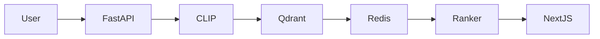
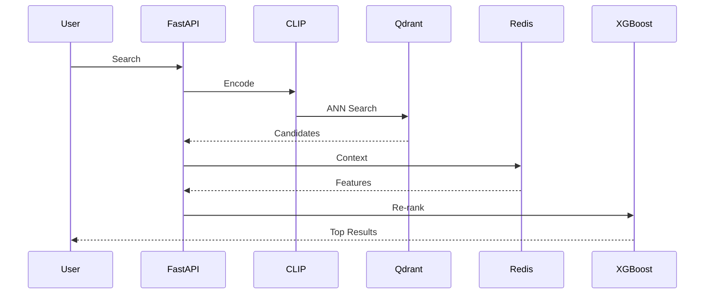
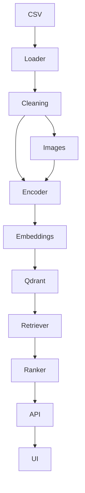

# SearchForge
[](#) [](#) [](#)
## Production-Grade Multi-Modal Visual Search & Context-Aware Re-ranking Engine
## Table of Contents
1. Overview
2. Features
3. Architecture
4. Data Flow
5. Technology Stack
6. Folder Structure
7. Installation
8. Configuration
9. Usage
10. API
11. Development Workflow
12. CI/CD
13. Testing
14. Performance
15. Deployment
16. Roadmap
17. Screenshots
18. FAQ
19. Troubleshooting
20. Contributing
21. License
22. References

# Overview
SearchForge is a production-ready semantic search platform built around CLIP, Qdrant, Redis, XGBoost, FastAPI and Next.js.

# Architecture



# Component Interaction



# Data Flow


# Technology Stack

|Component|Technology|
|---|---|
|ML|PyTorch + HuggingFace|
|Backend|FastAPI|
|Vector DB|Qdrant|
|Cache|Redis|
|Ranking|XGBoost|
|Frontend|Next.js + Tailwind CSS|
|Deployment|Docker|
# Performance Targets
- Retrieval <50ms
- API <150ms
- Recall >95%
- Uptime 99%
- Vector Dimension 512
- Index Size 10 Million
# Folder Structure
```text
SearchForge/
├── config/
│   ├── qdrant_config.json      # Qdrant collection configuration
│   └── xgboost_params.json     # Ranking model hyperparameters
│
├── data/
│   ├── processed/              # Processed datasets
│   │   └── .gitkeep
│   └── raw/
│       └── sample_products.csv # Sample product catalog
│
├── models/
│   ├── encoders/
│   │   └── .gitkeep            # CLIP checkpoints
│   └── ranker/
│       └── .gitkeep            # XGBoost models
│
├── src/
│   ├── api/
│   │   ├── main.py             # FastAPI entrypoint
│   │   └── routes.py           # Search endpoints
│   │
│   ├── core/
│   │   ├── config.py           # Global configuration
│   │   ├── embedding.py        # CLIP embedding engine
│   │   ├── image_processor.py
│   │   └── text_processor.py
│   │
│   ├── pipeline/
│   │   ├── data_loader.py
│   │   ├── build_embeddings.py
│   │   ├── ingest_vectors.py
│   │   └── train_ranker.py
│   │
│   ├── retrieval/
│   │   ├── collection_manager.py
│   │   └── search_service.py
│   │
│   └── reranking/
│       ├── feature_store.py
│       └── ranker_service.py
│
├── tests/
│   ├── test_retrieval.py
│   └── test_reranking.py
│
├── ui/
│   ├── src/
│   │   ├── app/
│   │   └── components/
│   └── package.json
│
├── docker-compose.yml
├── Dockerfile.api
├── requirements.txt
└── README.md
```
# Installation
## Docker
```bash
docker compose up --build
```
## Local
```bash
python -m venv .venv
pip install -r requirements.txt
uvicorn src.api.main:app --reload
```
## GPU
Install CUDA-enabled PyTorch before running embedding generation.
# Configuration
Environment variables include QDRANT_URL, REDIS_URL, MODEL_NAME, DEVICE, BATCH_SIZE.
# API Documentation
POST /search
POST /search/image
POST /search/hybrid
GET /health
# Development Workflow
Feature branch -> Tests -> PR -> Review -> Merge.
# CI/CD
GitHub Actions: lint, unit tests, integration tests, Docker build, security scan.
# Testing
pytest
coverage
integration tests with Docker Compose.
# Deployment
Docker Compose locally. Kubernetes planned.
# Roadmap
Phase 1 Embeddings
Phase 2 Vector Search
Phase 3 Re-ranking
Phase 4 API & UI
# Screenshots
Place images under docs/images.
# FAQ
Q: GPU required?
A: No, CPU supported.
# Troubleshooting
Check Redis, Qdrant, CUDA, environment variables.
# Contributing
Fork, branch, commit, PR.
# License
MIT
# References
FastAPI, Qdrant, PyTorch, HuggingFace, Redis, XGBoost documentation.

